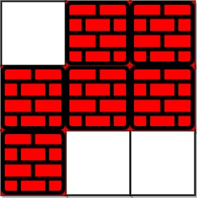

### [Shortest Path in a Grid with Obstacles Elimination](https://leetcode.com/problems/shortest-path-in-a-grid-with-obstacles-elimination/) <br>

You are given an `m x n` integer matrix `grid` where each cell is either `0` (empty) or `1` (obstacle). You can move up, down, left, or right from and to an empty cell in **one step**.

Return *the minimum number of ***steps*** to walk from the upper left corner `(0, 0)` to the lower right corner `(m - 1, n - 1)` given that you can eliminate ***at most*** `k` obstacles*. If it is not possible to find such walk return `-1`.


#### Example 1:


```
Input: grid = [[0,0,0],[1,1,0],[0,0,0],[0,1,1],[0,0,0]], k = 1
Output: 6
Explanation: 
The shortest path without eliminating any obstacle is 10.
The shortest path with one obstacle elimination at position (3,2) is 6. Such path is (0,0) -> (0,1) -> (0,2) -> (1,2) -> (2,2) -> (3,2) -> (4,2).

```

#### Example 2:


```
Input: grid = [[0,1,1],[1,1,1],[1,0,0]], k = 1
Output: -1
Explanation: We need to eliminate at least two obstacles to find such a walk.

```


# Solutions

### Python
```
class Solution:
    def shortestPath(self, grid: List[List[int]], k: int) -> int:
        '''
        BFS
        
        '''
        if not grid: return -1
        
        res=0
        q=collections.deque([(0,0,k,0)])
        vis=set()
        vis.add((0, 0, k)) # track current `row` `col` and current `k-obstacle count`
        
        h=len(grid)
        w=len(grid[0])
        target=(h-1, w-1)
        
        if k > (h-1 + w-1):
            return h-1 + w-1
        
        
        while q:
            row, col, cur_k, steps = q.pop()
            
            for d in [[-1,0],[0,1],[1,0],[0,-1]]:
                r=row+d[0]
                c=col+d[1]
                
                if  0 <= r < h and 0 <= c < w:
                    
                    if grid[r][c]==0 and (r, c, cur_k) not in vis:
                        vis.add((r, c, cur_k))
                        q.appendleft((r, c, cur_k, steps+1))
                        
                    elif grid[r][c]==1 and cur_k>0 and (r, c, cur_k-1) not in vis:
                        vis.add((r, c, cur_k-1)) # Track current k value -1 in vis. since we can land on the same cell from different paths.
                        q.appendleft((r, c, cur_k-1, steps+1))
                        
                    if (r, c) == target: # Exit early, since we need shortest path
                        return steps+1
        
        return -1

```
