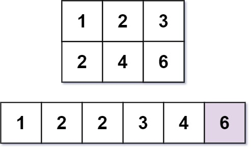

### [Kth Smallest Number in Multiplication Table](https://leetcode.com/problems/kth-smallest-number-in-multiplication-table/) <br>

Nearly everyone has used the Multiplication Table. The multiplication table of size `m x n` is an integer matrix `mat` where `mat[i][j] == i * j` (**1-indexed**).

Given three integers `m`, `n`, and `k`, return the `k-th` *smallest element in the `m x n` multiplication table*.


#### Example 1:


```
Input: m = 3, n = 3, k = 5
Output: 3
Explanation: The 5th smallest number is 3.

```

#### Example 2:


```
Input: m = 2, n = 3, k = 6
Output: 6
Explanation: The 6th smallest number is 6.

```


# Solutions

### Python
```
class Solution:
    def findKthNumber(self, m: int, n: int, k: int) -> int:
        '''
        Example:
          m=4 n=5 k=12
          
          1  2  3  4  5 
          2  4  6  8  10
          3  6  9  12 15
          4  8  12 16 20        
        '''
        def enough(x):
            count = 0
            for i in range(1, m+1):
                count += min(x // i, n)
            return count >= k

        lo, hi = 1, m * n
        while lo < hi:
            mi = lo+(hi-lo) // 2
            if not enough(mi):
                lo = mi + 1
            else:
                hi = mi
        return lo
    
```
