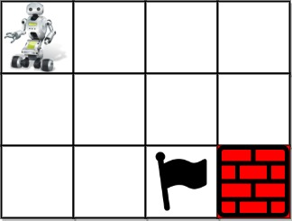

### [Unique Paths III](https://leetcode.com/problems/unique-paths-iii/) <br>

You are given an `m x n` integer array `grid` where `grid[i][j]` could be:

 - `1` representing the starting square. There is exactly one starting square.
 - `2` representing the ending square. There is exactly one ending square.
 - `0` representing empty squares we can walk over.
 - `-1` representing obstacles that we cannot walk over.
 Return the *number of 4-directional walks from the starting square to the ending square, that walk over every non-obstacle square exactly once*.


#### Example 1:


```
Input: grid = [[1,0,0,0],[0,0,0,0],[0,0,2,-1]]
Output: 2
Explanation: We have the following two paths: 
1. (0,0),(0,1),(0,2),(0,3),(1,3),(1,2),(1,1),(1,0),(2,0),(2,1),(2,2)
2. (0,0),(1,0),(2,0),(2,1),(1,1),(0,1),(0,2),(0,3),(1,3),(1,2),(2,2)
```

#### Example 2:


```
Input: grid = [[1,0,0,0],[0,0,0,0],[0,0,0,2]]
Output: 4
Explanation: We have the following four paths: 
1. (0,0),(0,1),(0,2),(0,3),(1,3),(1,2),(1,1),(1,0),(2,0),(2,1),(2,2),(2,3)
2. (0,0),(0,1),(1,1),(1,0),(2,0),(2,1),(2,2),(1,2),(0,2),(0,3),(1,3),(2,3)
3. (0,0),(1,0),(2,0),(2,1),(2,2),(1,2),(1,1),(0,1),(0,2),(0,3),(1,3),(2,3)
4. (0,0),(1,0),(2,0),(2,1),(1,1),(0,1),(0,2),(0,3),(1,3),(1,2),(2,2),(2,3)
```

#### Example 3:


```
Input: grid = [[0,1],[2,0]]
Output: 0
Explanation: There is no path that walks over every empty square exactly once.
Note that the starting and ending square can be anywhere in the grid.
```

# Solutions

### Python
```
class Solution:
    def uniquePathsIII(self, grid: List[List[int]]) -> int:
        h,w=len(grid),len(grid[0])
        start,end,cellsToGo=[0,0],[0,0],0
        for i in range(h):
            for j in range(w):
                if grid[i][j]==1:start=[i,j]
                if grid[i][j]==2:end=[i,j]                    
                if grid[i][j] >= 0:
                    cellsToGo += 1
        def back(r, c, remain):
            if r==end[0] and c==end[1] and remain==0:
                return 1
            if remain==0:
                return 0
            if r==end[0] and c==end[1]:
                return 0
            tmp=grid[r][c]
            grid[r][c]=-2
            res=0
            for d in [[0,1],[0,-1],[1,0],[-1,0]]:
                row,col=r+d[0], c+d[1]
                if row<0 or row>=h or col<0 or col>=w:
                    continue
                if grid[row][col]<0:
                    continue
                res += back(row,col, remain-1)
                
            grid[r][c]=tmp
            return res

        return back(start[0], start[1], cellsToGo-1)
```