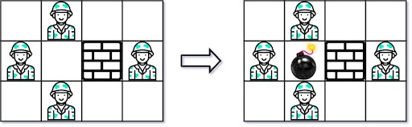
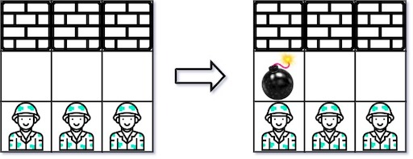

### [Bomb Enemy](https://leetcode.com/problems/bomb-enemy/) <br>

Given an `m x n` matrix `grid` where each cell is either a wall `'W'`, an enemy `'E'` or empty `'0'`, return *the maximum enemies you can kill using one bomb*. You can only place the bomb in an empty cell.

The bomb kills all the enemies in the same row and column from the planted point until it hits the wall since it is too strong to be destroyed.


#### Example 1:


```
Input: grid = [["0","E","0","0"],["E","0","W","E"],["0","E","0","0"]]
Output: 3

```

#### Example 2:


```
Input: grid = [["W","W","W"],["0","0","0"],["E","E","E"]]
Output: 1

```

# Solutions

### Python
```
class Solution:
    def maxKilledEnemies(self, grid: List[List[str]]) -> int:
        if len(grid) == 0:
            return 0
        h=len(grid)
        w=len(grid[0])
        
        row_hits=0
        col_hits=[0]*w
        
        res=0
        
        for row in range(h):
            for col in range(w):
                # if we are in the beginning of row or after the wall:
                if col==0 or grid[row][col-1]=="W":
                    row_hits=0
                    for k in range(col, w):
                        if grid[row][k]=="W":
                            # Stop if the wall
                            break
                        if grid[row][k]=="E":
                            row_hits += 1
                            
                # if we are in the beginning of col or after the wall:                            
                if row==0 or grid[row-1][col]=="W":
                    col_hits[col]=0
                    for k in range(row, h):
                        if grid[k][col]=="W":
                            break
                        if grid[k][col]=="E":
                            col_hits[col] += 1
                
                if grid[row][col]=="0":
                    res=max(res, row_hits+col_hits[col])
                
        return res

```
