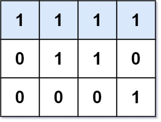

### [Longest Line of Consecutive One in Matrix](https://leetcode.com/problems/longest-line-of-consecutive-one-in-matrix/) <br>

Given an `m x n` binary matrix `mat`, return the **length of the longest line of consecutive one in the matrix**.

The line could be horizontal, vertical, diagonal, or anti-diagonal.


#### Example 1:


```
Input: mat = [[0,1,1,0],[0,1,1,0],[0,0,0,1]]
Output: 3
```

#### Example 2:


```
Input: mat = [[1,1,1,1],[0,1,1,0],[0,0,0,1]]
Output: 4

```

# Solutions

### Python
```
class Solution:
    def longestLine(self, M: List[List[int]]) -> int:
        '''
        Just like TIC TAC TOE with mapping
        
        '''
        h=len(M)
        w=len(M[0])
        
        rows = collections.defaultdict(int)
        cols= collections.defaultdict(int)
        diag_asc = collections.defaultdict(int)  # Ascending diagonal
        diag_des = collections.defaultdict(int)  # Descending diagonal
        res = 0
        
        for row in range(h):
            for col in range(w):
                if M[row][col]==0:
                    # break increasing
                    rows[row]=0
                    cols[col]=0
                    diag_asc[row+col]=0
                    diag_des[row-col]=0
                else:
                    rows[row] += 1
                    cols[col] += 1
                    diag_asc[row+col] += 1
                    diag_des[row-col] += 1
                    
                    res=max(res, rows[row], cols[col], diag_asc[row+col], diag_des[row-col])
                    
        return res        
        
        
        
#     def longestLine(self, M: List[List[int]]) -> int:
#         '''
#         Dynamic Programming
        
#         '''
#         if not M: return 0
#         h=len(M)
#         w=len(M[0])
#         res=0
        
#         dp = [[ [0, 0, 0, 0] for j in range(w)] for i in range(h)]
        
#         for row in range(h):
#             for col in range(w):
#                 if M[row][col]==1:
                    
#                     dp[row][col][0] = dp[row][col-1][0] + 1 if col > 0 else 1
#                     dp[row][col][1] = dp[row-1][col][1] + 1 if row > 0 else 1
#                     dp[row][col][2] = dp[row-1][col-1][2] + 1 if row > 0 and col > 0 else 1           # descending Diagonal
#                     dp[row][col][3] = dp[row-1][col+1][3] + 1 if row > 0 and col < len(M[0])-1 else 1 # ascending  Diagonal
                    
#                     res = max(res, dp[row][col][0], dp[row][col][1], dp[row][col][2], dp[row][col][3])
                                    
        
#         return res
```
