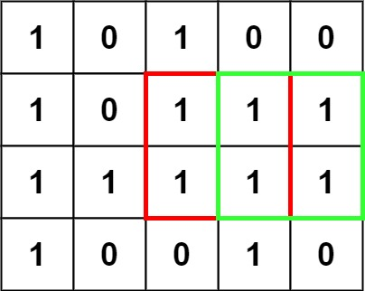

### [Maximal Square](https://leetcode.com/problems/maximal-square/) <br>

Given an `m x n` binary `matrix` filled with `0`'s and `1`'s, find the largest square containing only `1`'s and return its area.

#### Example 1:


```
Input: matrix = [["1","0","1","0","0"],["1","0","1","1","1"],["1","1","1","1","1"],["1","0","0","1","0"]]
Output: 4
```


#### Example 2:


```
Input: matrix = [["0","1"],["1","0"]]
Output: 1
```


#### Example 3:
```
Input: matrix = [["0"]]
Output: 0
```


# Solutions

### Python
```
class Solution:
    def maximalSquare(self, matrix: List[List[str]]) -> int:
        if not matrix: return 0
        h=len(matrix)
        w=len(matrix[0])
        
        dp=[[0 for _ in range(w+1)] for _ in range(h+1)]
        
        res=0
        for i in range(1, h+1):
            for j in range(1, w+1):
                if matrix[i-1][j-1]=="1":
                    dp[i][j]=1+min(dp[i-1][j], dp[i][j-1], dp[i-1][j-1])
                    res=max(res, dp[i][j])
        
        print(dp)
        return res ** 2

```
