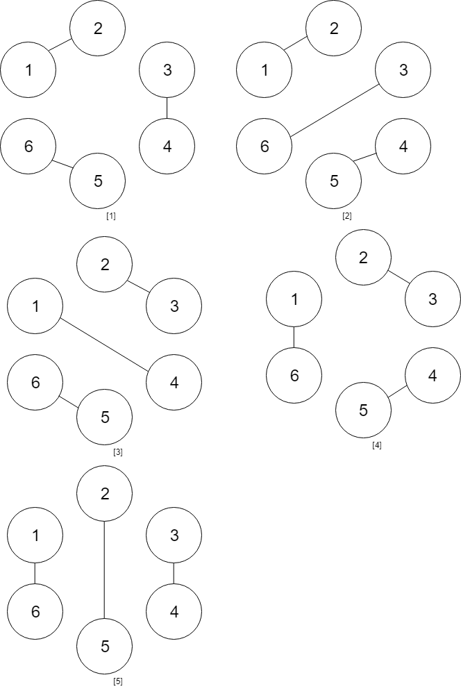

### [Handshakes That Don't Cross](https://leetcode.com/problems/handshakes-that-dont-cross/) <br>

You are given an **even** number of people `numPeople` that stand around a circle and each person shakes hands with someone else so that there are `numPeople / 2` handshakes total.

Return *the number of ways these handshakes could occur such that none of the handshakes cross*.

Since the answer could be very large, return it **modulo**  + .


#### Example 1:


```
Input: numPeople = 4
Output: 2
Explanation: There are two ways to do it, the first way is [(1,2),(3,4)] and the second one is [(2,3),(4,1)].

```

#### Example 2:


```
Input: numPeople = 6
Output: 5

```


# Solutions

### Python
```
class Solution:
#     def numberOfWays(self, numPeople: int) -> int:
#         @lru_cache(None)
#         def dfs(n):
#             if n%2==1:
#                 return 0
#             if n==0:
#                 return 1
#             res=0
#             for i in range(0,n,2):
#                 left = dfs(i)
#                 right = dfs(n-2-i)
#                 res += left*right
                
#                 res %= 1000000007
#             return res
        
#         return dfs(numPeople)
        
    def numberOfWays(self, numPeople: int) -> int:
        '''
        Catalan DP Tabulation
        
        C(4) = C0*C3 + C1*C2 + C2*C2 + C3*C0        
        Catalan Classical:
            dp[4] = dp[0]*dp[3] + dp[1]*dp[2] + dp[2]*dp[1] + dp[3]*dp[0]
        
        
        C(4) = C0*C2 + C1*C1 + C2*C0 + (C3*C-1) == 0
        Catalan Here:
            dp[4] = dp[0]*dp[2] + dp[1]*dp[1] + dp[2]*dp[0] + dp[3]*dp[-1] (dp[-1]==0)
        '''
        n=numPeople
        dp = [0] * (n+1)
        dp[0] = 1
        for i in range(1, n+1):
            for j in range(i):
                dp[i] += dp[j] * dp[i-2-j] # dp[j] * dp[i-1-j] ---- in real Catalan
                dp[i] %= 1000000007
        return dp[n]    
        
#     def numberOfWays(self, numPeople: int) -> int:
#         '''
#         Memoization Catalan
#         '''
#         @lru_cache(None)
#         def dfs(n):
#             if n%2==1:
#                 return 0
#             if n == 0:
#                 return 1
#             if n == 1:
#                 return 1

#             res = 0
#             for i in range(n):
#                 left = dfs(i)
#                 right = dfs(n - i - 2) # right = dfs(n - i - 1) --- in real Catalan
#                 res += left * right
#                 res %= 1000000007                
#             return res

#         return dfs(numPeople)

```
