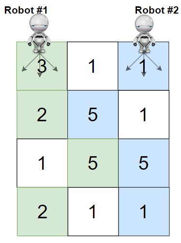
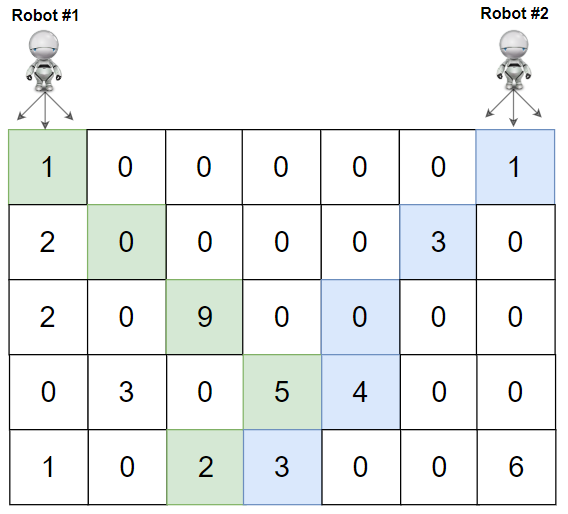

### [Cherry Pickup II](https://leetcode.com/problems/cherry-pickup-ii/) <br>

You are given a `rows x cols` matrix `grid` representing a field of cherries where `grid[i][j]` represents the number of cherries that you can collect from the `(i, j)` cell.

You have two robots that can collect cherries for you:

 - **Robot #1** is located at the **top-left corner** `(0, 0)`, and
 - **Robot #2** is located at the **top-right corner** `(0, cols - 1)`.

Return *the maximum number of cherries collection using both robots by following the rules below*:

 - From a cell `(i, j)`, robots can move to cell `(i + 1, j - 1)`, `(i + 1, j)`, or `(i + 1, j + 1)`.
 - When any robot passes through a cell, It picks up all cherries, and the cell becomes an empty cell.
 - When both robots stay in the same cell, only one takes the cherries.
 - Both robots cannot move outside of the grid at any moment.
 - Both robots should reach the bottom row in `grid`.


#### Example 1:


```
Input: grid = [[3,1,1],[2,5,1],[1,5,5],[2,1,1]]
Output: 24
Explanation: Path of robot #1 and #2 are described in color green and blue respectively.
Cherries taken by Robot #1, (3 + 2 + 5 + 2) = 12.
Cherries taken by Robot #2, (1 + 5 + 5 + 1) = 12.
Total of cherries: 12 + 12 = 24.

```

#### Example 2:


```
Input: grid = [[1,0,0,0,0,0,1],[2,0,0,0,0,3,0],[2,0,9,0,0,0,0],[0,3,0,5,4,0,0],[1,0,2,3,0,0,6]]
Output: 28
Explanation: Path of robot #1 and #2 are described in color green and blue respectively.
Cherries taken by Robot #1, (1 + 9 + 5 + 2) = 17.
Cherries taken by Robot #2, (1 + 3 + 4 + 3) = 11.
Total of cherries: 17 + 11 = 28.

```


# Solutions

### Python
```
class Solution:
    def cherryPickup(self, grid: List[List[int]]) -> int:
        '''
        Memoization
        Robots move in sync. should be same row
        '''
        h, w = len(grid), len(grid[0])

        @lru_cache(None)
        def dfs(r, c1, c2):
            if r == h: return 0
                            
            res = 0
            for nc1 in range(c1-1, c1+2): # 1 of 3 possible for robot1
                for nc2 in range(c2-1, c2+2): # 1 of 3 possible for robot2
                    if 0<=nc1<w and 0 <=nc2<w: # check if within boundaries
                        res = max(res, dfs(r+1, nc1, nc2))
                        
            if c1 == c2:
                cherries = grid[r][c1] # if same row pick once
            else:
                cherries = grid[r][c1] + grid[r][c2] # differen row pick both
            return res + cherries

        return dfs(0, 0, w-1)
```
