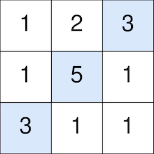
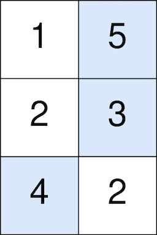

### [Maximum Number of Points with Cost](https://leetcode.com/problems/maximum-number-of-points-with-cost/) <br>

You are given an `m x n` integer matrix `points` (**0-indexed**). Starting with `0` points, you want to **maximize** the number of points you can get from the matrix.

To gain points, you must pick one cell in **each row**. Picking the cell at coordinates `(r, c)` will **add** `points[r][c]` to your score.

However, you will lose points if you pick a cell too far from the cell that you picked in the previous row. For every two adjacent rows `r` and `r + 1` (where `0 <= r < m - 1`), picking cells at coordinates `(r, c1)` and `(r + 1, c2)` will **subtract** `abs(c1 - c2)` from your score.

Return the **maximum** number of points you can achieve.


abs(x) is defined as:
`x` for `x >= 0`.
`-x` for `x < 0`.


#### Example 1:


```
Input: points = [[1,2,3],[1,5,1],[3,1,1]]
Output: 9
Explanation:
The blue cells denote the optimal cells to pick, which have coordinates (0, 2), (1, 1), and (2, 0).
You add 3 + 5 + 3 = 11 to your score.
However, you must subtract abs(2 - 1) + abs(1 - 0) = 2 from your score.
Your final score is 11 - 2 = 9.

```


#### Example 2:


```
Input: points = [[1,5],[2,3],[4,2]]
Output: 11
Explanation:
The blue cells denote the optimal cells to pick, which have coordinates (0, 1), (1, 1), and (2, 0).
You add 5 + 3 + 4 = 12 to your score.
However, you must subtract abs(1 - 1) + abs(1 - 0) = 1 from your score.
Your final score is 12 - 1 = 11.

```


# Solutions

### Python
```
class Solution:
    def maxPoints(self, points: List[List[int]]) -> int:
        '''
        Same as Minimum Falling Path Sum but instead of looking in 3 adjacent rows we looking in entire array.
        
        We build left and right maximums arrays for each row
        And take maximum from each
            Exmplanations here: https://leetcode.com/problems/maximum-number-of-points-with-cost/discuss/1344908/C%2B%2BJavaPython-3-DP-Explanation-with-pictures.
            
            left[c]=max(left[c-1]-1, dp[r+1][c])
            
            
        Why we just compare pre[2] and lft[1] - 1, why its not necessary to compare lft[0] - 2 as well?
        Assume we do compare: lft[1] - 1 and lft[0] - 2 for index 2
        Add 1 to each term and we have: lft[1], lft[0] - 1.
        That is exactly the previous comparison we made for index 1, meaning we have already selected the maximum value for the previous        index, shifting all previous candidates by 1 doenst change the result.
                        
            
            
        '''
        if not points: return 0
        h=len(points)
        w=len(points[0])
        dp=[[0 for _ in range(w)] for _ in range(h)] # could be just 1d array
        dp[-1]=points[-1]
        # print(dp)
        res=max(points[-1])
        
        for r in range(h-1)[::-1]:
            left=[-1]*w
            right=[-1]*w            
            for c in range(w):
                left[c]=max(left[c-1]-1, dp[r+1][c])
                right[~c]=max(right[~c+1]-1, dp[r+1][~c])
                
            for c in range(w):
                dp[r][c]=points[r][c]+max(right[c], left[c])            
            
        # for row in dp:
        #     print(row)
        return max(dp[0])

```
