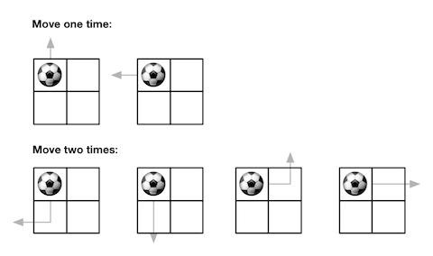
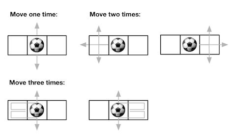

### [Out of Boundary Paths](https://leetcode.com/problems/out-of-boundary-paths/) <br>

There is an `m x n` grid with a ball. The ball is initially at the position `[startRow, startColumn]`. You are allowed to move the ball to one of the four adjacent cells in the grid (possibly out of the grid crossing the grid boundary). You can apply **at most** `maxMove` moves to the ball.

Given the five integers `m`, `n`, `maxMove`, `startRow`, `startColumn`, return the number of paths to move the ball out of the grid boundary. Since the answer can be very large, return it **modulo** `109 + 7`.


#### Example 1:


```
Input: m = 2, n = 2, maxMove = 2, startRow = 0, startColumn = 0
Output: 6

```

#### Example 2:


```
Input: m = 1, n = 3, maxMove = 3, startRow = 0, startColumn = 1
Output: 12

```

# Solutions

### Python
```
class Solution:
    def findPaths(self, m: int, n: int, maxMove: int, startRow: int, startColumn: int) -> int:
        '''
        Dynamic Programming
        Tabulation
        '''
        M = 1000000007
        dp=[[0 for _ in range(n)] for _ in range(m)]
        dp[startRow][startColumn]=1
        count=0
        
        for move in range(1, maxMove+1):
            temp=[[0 for _ in range(n)] for _ in range(m)]
            for r in range(m):
                for c in range(n):
                    # If in Boundary
                    if r==(m-1):
                        count += dp[r][c] % M
                    if c==(n-1):
                        count += dp[r][c] % M
                    if r==0:
                        count += dp[r][c] % M
                    if c==0:
                        count += dp[r][c] % M
                        
                    c1=dp[r-1][c] if r>0 else 0  
                    c2=dp[r+1][c] if r<(m-1) else 0
                    c3=dp[r][c-1] if c>0 else 0
                    c4=dp[r][c+1] if c<(n-1) else 0
                        
                    temp[r][c]= ((c1+c2)%M + (c3+c4)%M) % M
                    
            dp=temp            
        return count % M
    
    
#     def findPaths(self, m: int, n: int, maxMove: int, startRow: int, startColumn: int) -> int:
#         '''
#         DFS
#         '''
#         M = 1000000007
#         memo={}
#         def dfs(r,c, moves):
#             if r<0 or c<0 or r==m or c==n:
#                 return 1
#             if moves==0:
#                 return 0

#             if (r,c,moves) in memo.keys():
#                 return memo[(r,c,moves)]
            
            
#             memo[(r,c,moves)]=dfs(r-1, c, moves-1)+dfs(r+1,c, moves-1)+dfs(r,c+1, moves-1)+dfs(r,c-1, moves-1)
#             return memo[(r,c,moves)] % M 
        
        
#         return dfs(startRow, startColumn, maxMove)
        
```
