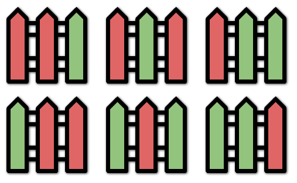

### [Paint Fence](https://leetcode.com/problems/paint-fence/) <br>

You are painting a fence of `n` posts with `k` different colors. You must paint the posts following these rules:

 - Every post must be painted **exactly one** color.
 - There **cannot** be three or more **consecutive** posts with the same color.

Given the two integers `n` and `k`, return the ***number of ways*** *you can paint the fence*.


#### Example 1:


```
Input: n = 3, k = 2
Output: 6
Explanation: All the possibilities are shown.
Note that painting all the posts red or all the posts green is invalid because there cannot be three posts in a row with the same color.

```

#### Example 2:

```
Input: n = 1, k = 1
Output: 1

```

#### Example 3:

```
Input: n = 7, k = 2
Output: 42

```


# Solutions

### Python
```
class Solution:
    def numWays(self, n: int, k: int) -> int:
        '''
        Tabulation
        '''
        if n==1:
            return k
        if n==2:
            return k*k
        dp=[0]*(n)
        dp[0]=k
        dp[1]=k*k
        for i in range(2, n):
            dp[i]=(k-1)*(dp[i-1]+dp[i-2])
        return dp[-1]
    
#     def numWays(self, n: int, k: int) -> int:
#         '''
#         Memoization
#         '''
#         @lru_cache(None)
#         def dfs(n):
#             if n==1:
#                 return k
#             if n==2:
#                 return k*k

#             return (k-1)*(dfs(n-1)+dfs(n-2))
            
#         return dfs(n)
```
