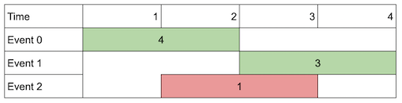
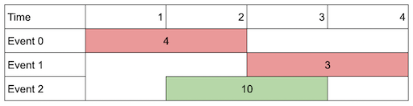
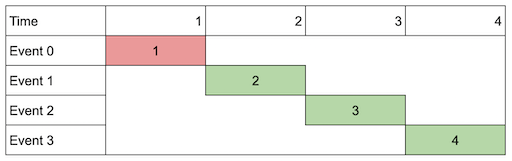

### [Maximum Number of Events That Can Be Attended II](https://leetcode.com/problems/maximum-number-of-events-that-can-be-attended-ii/) <br>

You are given an array of `events` where  = [, , ]. The  event starts at  and ends at , and if you attend this event, you will receive a value of . You are also given an integer `k` which represents the maximum number of events you can attend.

You can only attend one event at a time. If you choose to attend an event, you must attend the **entire** event. Note that the end day is **inclusive**: that is, you cannot attend two events where one of them starts and the other ends on the same day.

Return *the ***maximum sum*** of values that you can receive by attending events*.

#### Example 1:


```
Input: events = [[1,2,4],[3,4,3],[2,3,1]], k = 2
Output: 7
Explanation: Choose the green events, 0 and 1 (0-indexed) for a total value of 4 + 3 = 7.

```

#### Example 2:


```
Input: events = [[1,2,4],[3,4,3],[2,3,10]], k = 2
Output: 10
Explanation: Choose event 2 for a total value of 10.
Notice that you cannot attend any other event as they overlap, and that you do not have to attend k events.

```

#### Example 3:


```
Input: events = [[1,1,1],[2,2,2],[3,3,3],[4,4,4]], k = 3
Output: 9
Explanation: Although the events do not overlap, you can only attend 3 events. Pick the highest valued three.

```


# Solutions

### Python
```
class Solution:
#     def maxValue(self, events: List[List[int]], k: int) -> int:
#         '''
#         Memoization (TLE)
#         '''
#         events.sort(key=lambda x: x[0])
#         res=0
        
#         @lru_cache(None)
#         def dfs(first, last_end, path, kk):
#             nonlocal res
#             if kk==k:
#                 res=max(res, path)
#                 return
            
#             for i in range(first,len(events)):
#                 st,en,val=events[i]
#                 if last_end<st:
#                     res=max(res, path+val)                    
#                     dfs(i+1, en, path+val, kk+1)
            
#         dfs(0, 0, 0, 0)
#         return res

    
    def maxValue(self, events: List[List[int]], k: int) -> int:
        '''
        Memoization
        '''
        events.sort(key=lambda x:(x[0], x[1]))
        n=len(events)
        
        @lru_cache(None)
        def dp(i,k):
            if k==0:
                return 0
            if i>=n:
                return 0
                                    
            lo=i
            hi=n
            target=events[i][1]+1 # endDay+1
            while lo<hi:
                mid=lo+(hi-lo)//2
                if events[mid][0]<target: # compare with startDay
                    lo=mid+1
                else:
                    hi=mid
            next_index=lo
            
            skip = dp(i+1, k)
            not_skip = events[i][2]+dp(lo, k-1)
            return max(skip, not_skip )
            
        return dp(0, k)

```
