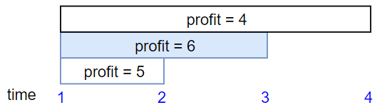

### [Maximum Profit in Job Scheduling](https://leetcode.com/problems/maximum-profit-in-job-scheduling/) <br>

We have n jobs, where every job is scheduled to be done from `startTime[i]` to `endTime[i]`, obtaining a profit of `profit[i]`.

You're given the `startTime`, `endTime` and `profit` arrays, return the maximum profit you can take such that there are no two jobs in the subset with overlapping time range.

If you choose a job that ends at time `X` you will be able to start another job that starts at time `X`.


#### Example 1:


```
Input: startTime = [1,2,3,3], endTime = [3,4,5,6], profit = [50,10,40,70]
Output: 120
Explanation: The subset chosen is the first and fourth job. 
Time range [1-3]+[3-6] , we get profit of 120 = 50 + 70.

```

#### Example 2:


```
Input: startTime = [1,2,3,4,6], endTime = [3,5,10,6,9], profit = [20,20,100,70,60]
Output: 150
Explanation: The subset chosen is the first, fourth and fifth job. 
Profit obtained 150 = 20 + 70 + 60.

```

#### Example 3:


```
Input: startTime = [1,1,1], endTime = [2,3,4], profit = [5,6,4]
Output: 6

```


# Solutions

### Python
```
class Solution:
    def jobScheduling(self, startTime: List[int], endTime: List[int], profit: List[int]) -> int:
        '''
        Memoizaion  same as Maximum Number of Events That Can Be Attended II
        but without `k` limitation
        '''
        n=len(startTime)
        arr=[]
        for i in range(n):
            arr.append((startTime[i], endTime[i], profit[i]))
        arr.sort(key=lambda x: x[0])
        
        @lru_cache(None)
        def dfs(i):
            if i>=n:
                return 0

            lo=0
            hi=n
            target=arr[i][1] # endTime+1
            while lo<hi:
                mid=lo+(hi-lo)//2
                if arr[mid][0]<target: # startTime
                    lo=mid+1
                else:
                    hi=mid
                    
            skip = dfs(i+1)
            not_skip = arr[i][2]+dfs(lo)
            return max(skip, not_skip)
        
        return dfs(0)

```
