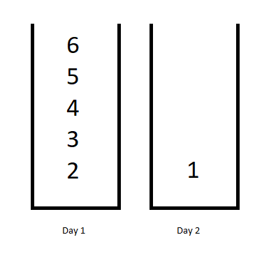

### [Minimum Difficulty of a Job Schedule](https://leetcode.com/problems/minimum-difficulty-of-a-job-schedule/) <br>

You want to schedule a list of jobs in `d` days. Jobs are dependent (i.e To work on the `i-th` job, you have to finish all the jobs `j` where `0 <= j < i`).

You have to finish **at least** one task every day. The difficulty of a job schedule is the sum of difficulties of each day of the `d` days. The difficulty of a day is the maximum difficulty of a job done in that day.

Given an array of integers `jobDifficulty` and an integer `d`. The difficulty of the `i-th` job is `jobDifficulty[i]`.

Return the *minimum difficulty* of a job schedule. If you cannot find a schedule for the jobs return **-1**.


#### Example 1:


```
Input: jobDifficulty = [6,5,4,3,2,1], d = 2
Output: 7
Explanation: First day you can finish the first 5 jobs, total difficulty = 6.
Second day you can finish the last job, total difficulty = 1.
The difficulty of the schedule = 6 + 1 = 7 

```

#### Example 2:

```
Input: jobDifficulty = [9,9,9], d = 4
Output: -1
Explanation: If you finish a job per day you will still have a free day. you cannot find a schedule for the given jobs.

```


#### Example 3:

```
Input: jobDifficulty = [1,1,1], d = 3
Output: 3
Explanation: The schedule is one job per day. total difficulty will be 3.

```


#### Example 4:

```
Input: jobDifficulty = [7,1,7,1,7,1], d = 3
Output: 15

```


#### Example 5:

```
Input: jobDifficulty = [11,111,22,222,33,333,44,444], d = 6
Output: 843

```

# Solutions

### Python
```
class Solution:
    def minDifficulty(self, jobDifficulty: List[int], d: int) -> int:
        '''
        Tabulation
            Example:
                jobDifficulty = [3,1,4,1,7,1]
                d = 3
                output: 11
        
            Start with:
                [3, inf, inf]
                [3, inf, inf]
                [4, inf, inf]
                [4, inf, inf]
                [7, inf, inf]
                [7, inf, inf]        
                
            End with:
                [3, inf, inf]
                [3,   4, inf]
                [4,   7,   8]
                [4,   5,   8]
                [7,  10,  11]
                [7,   8,  11]        
        
        '''
        
        
        n=len(jobDifficulty)
        if d>n: return -1
        
        impossible=float('inf')
        
        dp=[[impossible]*d for _ in range(n)]
        dp[0][0]=jobDifficulty[0]
        for i in range(1, n):
            dp[i][0]=max(dp[i-1][0], jobDifficulty[i])

        for day in range(1, d):
            for job in range(1, n):
                maxDiff=0
                for doneJob in range(job+1)[::-1]:
                    maxDiff = max(maxDiff, jobDifficulty[doneJob])                    
                    dp[job][day]=min(dp[job][day], dp[doneJob-1][day-1] + maxDiff)
                                        
        if dp[-1][-1]==impossible:
            return -1
        return dp[-1][-1]        
```
