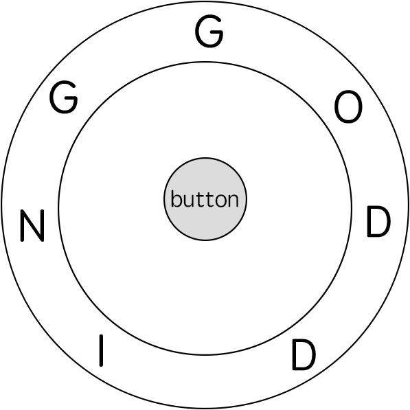

### [Freedom Trail](https://leetcode.com/problems/freedom-trail/) <br>

In the video game Fallout 4, the quest **"Road to Freedom"** requires players to reach a metal dial called the **"Freedom Trail Ring"** and use the dial to spell a specific keyword to open the door.

Given a string `ring` that represents the code engraved on the outer ring and another string `key` that represents the keyword that needs to be spelled, return the *minimum number of steps* to spell all the characters in the keyword.

Initially, the first character of the ring is aligned at the `"12:00"` direction. You should spell all the characters in `key` one by one by rotating `ring` clockwise or anticlockwise to make each character of the string key aligned at the `"12:00"` direction and then by pressing the center button.

At the stage of rotating the ring to spell the key character `key[i]`:

 1. You can rotate the ring clockwise or anticlockwise by one place, which counts as **one step**. The final purpose of the rotation is to align one of ring's characters at the `"12:00"` direction, where this character must equal `key[i]`.
 2. If the character `key[i]` has been aligned at the `"12:00"` direction, press the center button to spell, which also counts as **one step**. After the pressing, you could begin to spell the next character in the key (next stage). Otherwise, you have finished all the spelling.


#### Example 1:


```
Input: ring = "godding", key = "gd"
Output: 4
Explanation:
For the first key character 'g', since it is already in place, we just need 1 step to spell this character. 
For the second key character 'd', we need to rotate the ring "godding" anticlockwise by two steps to make it become "ddinggo".
Also, we need 1 more step for spelling.
So the final output is 4.

```

#### Example 2:

```
Input: ring = "godding", key = "godding"
Output: 13

```


# Solutions

### Python
```
class Solution: 
    def findRotateSteps(self, ring: str, key: str) -> int:
        W, H = len(ring), len(key)
        def steps(i, k):
            d = abs(i-k)
            return min(d, W-d)
        
        @lru_cache(None)
        def dfs(i, j):
            if j==H:
                return 0
            out = sys.maxsize
            for k in range(W):
                if ring[k]==key[j]:
                    out = min(out, 1+steps(i,k)+dfs(k,j+1))
            return out
        return dfs(0,0)
        
#     def findRotateSteps(self, ring: str, key: str) -> int:
#         '''
#         [inf, inf, inf, 0]
#         [inf, inf, inf, 0]
#         [inf, inf, inf, 0]
#         [inf, inf, inf, 0]
#         [inf, inf, inf, 0]
#         [inf, inf, inf, 0]
#         [inf, inf, inf, 0]

#         [inf, inf, 4, 0]
#         [inf, inf, 4, 0]
#         [inf, inf, 3, 0]
#         [inf, inf, 2, 0]
#         [inf, inf, 1, 0]
#         [inf, inf, 2, 0]
#         [inf, inf, 3, 0]

#         [inf, 6, 4, 0]
#         [inf, 5, 4, 0]
#         [inf, 4, 3, 0]
#         [inf, 3, 2, 0]
#         [inf, 4, 1, 0]
#         [inf, 5, 2, 0]
#         [inf, 6, 3, 0]

#         [7, 6, 4, 0]
#         [8, 5, 4, 0]
#         [9, 4, 3, 0]
#         [10, 3, 2, 0]
#         [9, 4, 1, 0]
#         [8, 5, 2, 0]
#         [7, 6, 3, 0]
#         '''
#         M, N = len(ring), len(key)
#         def steps(i, k):
#             x = abs(i - k)
#             return min(x, M - x)
#         dp = [[float('inf') for _ in range(N + 1)] for _ in range(M)]
#         for i in range(M):
#             dp[i][N] = 0 
#         for j in range(N - 1, -1, -1):
#             for i in range(M):        
#                 for k in range(M): 
#                     if ring[k] == key[j]:
#                         dp[i][j] = min(dp[i][j], 1 + steps(i, k) + dp[k][j + 1]) 

#         return dp[0][0]


```

