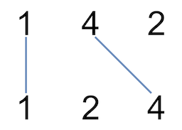

### [Uncrossed Lines](https://leetcode.com/problems/uncrossed-lines/) <br>

You are given two integer arrays `nums1` and `nums2`. We write the integers of `nums1` and `nums2` (in the order they are given) on two separate horizontal lines.

We may draw connecting lines: a straight line connecting two numbers `nums1[i]` and `nums2[j]` such that:

 - `nums1[i] == nums2[j]`, and
 - the line we draw does not intersect any other connecting (non-horizontal) line.

Note that a connecting line cannot intersect even at the endpoints (i.e., each number can only belong to one connecting line).

Return the **maximum number of connecting lines we can draw in this way**.


#### Example 1:


```
Input: nums1 = [1,4,2], nums2 = [1,2,4]
Output: 2
Explanation: We can draw 2 uncrossed lines as in the diagram.
We cannot draw 3 uncrossed lines, because the line from nums1[1] = 4 to nums2[2] = 4 will intersect the line from nums1[2]=2 to nums2[1]=2.

```

#### Example 2:

```
Input: nums1 = [2,5,1,2,5], nums2 = [10,5,2,1,5,2]
Output: 3

```

#### Example 3:

```
Input: nums1 = [1,3,7,1,7,5], nums2 = [1,9,2,5,1]
Output: 2

```

# Solutions

### Python
```
class Solution:
    def maxUncrossedLines(self, nums1: List[int], nums2: List[int]) -> int:
        '''
        Full implementation copy of Longest Common Subsequence, just rephrased task
        '''
        n1=len(nums1)
        n2=len(nums2)
        
        dp=[[0 for _ in range(n2+1)] for _ in range(n1+1)]
        
        for r in range(n1)[::-1]:
            for c in range(n2)[::-1]:
                if nums1[r]==nums2[c]:
                    dp[r][c]=1+dp[r+1][c+1]
                else:
                    dp[r][c]=max(dp[r+1][c], dp[r][c+1])
             
        # for row in dp:
        #     print(row)
        return dp[0][0]
```
