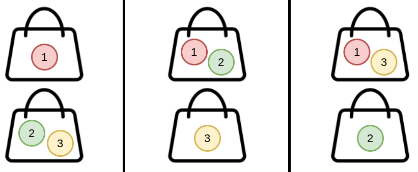

### [Count Ways to Distribute Candies](https://leetcode.com/problems/count-ways-to-distribute-candies/) <br>

There are `n` **unique** candies (labeled `1` through `n`) and `k` bags. You are asked to distribute **all** the candies into the bags such that every bag has **at least** one candy.

There can be multiple ways to distribute the candies. Two ways are considered **different** if the candies in one bag in the first way are not all in the same bag in the second way. The order of the bags and the order of the candies within each bag do not matter.

For example, `(1), (2,3)` and `(2), (1,3)` are considered different because candies `2` and `3` in the bag `(2,3)` in the first way are not in the same bag in the second way (they are split between the bags `(2)` and `(1,3)`). However, `(1), (2,3)` and `(3,2), (1)` are considered the same because the candies in each bag are all in the same bags in both ways.

Given two integers, `n` and `k`, return *the ***number*** of different ways to distribute the candies*. As the answer may be too large, return it **modulo**  + .


#### Example 1:


```
Input: n = 3, k = 2
Output: 3
Explanation: You can distribute 3 candies into 2 bags in 3 ways:
(1), (2,3)
(1,2), (3)
(1,3), (2)

```

#### Example 2:

```
Input: n = 4, k = 2
Output: 7
Explanation: You can distribute 4 candies into 2 bags in 7 ways:
(1), (2,3,4)
(1,2), (3,4)
(1,3), (2,4)
(1,4), (2,3)
(1,2,3), (4)
(1,2,4), (3)
(1,3,4), (2)

```

#### Example 3:

```
Input: n = 20, k = 5
Output: 206085257
Explanation: You can distribute 20 candies into 5 bags in 1881780996 ways. 1881780996 modulo 109 + 7 = 206085257.

```


# Solutions

### Python
```
class Solution:
    def waysToDistribute(self, n: int, k: int) -> int:
        '''
        Two cases are included: the c-th candy is put in a bag alone, or mixed with others in the bag.

         1. The number of first case is just case (c-1, b-1) , 
         since the c-th candy is in a bag alone, the rest c-1 candies are in b-1 bags.

         2. For the second case, we just need to get the number of case (c-1, b), 
         and randomly pick a bag from b bags and put the c-th candy in, 
         so its guaranteed that c-th candy is mixed with other candies. 
         The total number of this case is case (c-1, b) * b (since there will be b bags for option)

        Finally we have dp[c][b]= dp[c-1][b-1] + dp[c-1][b] * b
        
        '''
        
        @lru_cache(2000)
        def dp(c,b):
            if b<0 or c<b: # no bag or not enough candies for each bag
                return 0
            if c==b:
                return 1
            
            return (dp(c-1,b-1) + dp(c-1,b) * b) % 1000000007
            
        return dp(n,k)
    
    def waysToDistribute(self, n: int, k: int) -> int:
        '''
        Example n=4 k=3   4-candies, 3 bags
        Start with:
            [1, 1, 1, 1]
            [1, 1, 1, 1]
            [1, 1, 1, 1]
            [1, 1, 1, 1]
        End with:
            [1, 1, 1, 1]
            [1, 1, 1, 1]
            [1, 3, 1, 1]
            [1, 7, 6, 1]
        '''    
        dp=[[1]*n for _ in range(n)]
        for c in range(2,n):
            for b in range(1,min(c,k)):
                dp[c][b]=dp[c-1][b-1]+dp[c-1][b]*(b+1)
        return dp[n-1][k-1] % 1000000007
```
