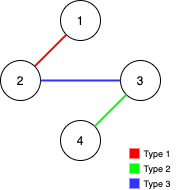

### [Remove Max Number of Edges to Keep Graph Fully Traversable](https://leetcode.com/problems/remove-max-number-of-edges-to-keep-graph-fully-traversable/) <br>

Alice and Bob have an undirected graph of `n` nodes and 3 types of edges:

 - Type 1: Can be traversed by Alice only.
 - Type 2: Can be traversed by Bob only.
 - Type 3: Can by traversed by both Alice and Bob.

Given an array `edges` where  = [, , ] represents a bidirectional edge of type  between nodes  and , find the maximum number of edges you can remove so that after removing the edges, the graph can still be fully traversed by both Alice and Bob. The graph is fully traversed by Alice and Bob if starting from any node, they can reach all other nodes.

Return *the maximum number of edges you can remove, or return `-1` if it's impossible for the graph to be fully traversed by Alice and Bob*.


#### Example 1:


```
Input: n = 4, edges = [[3,1,2],[3,2,3],[1,1,3],[1,2,4],[1,1,2],[2,3,4]]
Output: 2
Explanation: If we remove the 2 edges [1,1,2] and [1,1,3]. The graph will still be fully traversable by Alice and Bob. Removing any additional edge will not make it so. So the maximum number of edges we can remove is 2.

```

#### Example 2:


```
Input: n = 4, edges = [[3,1,2],[3,2,3],[1,1,4],[2,1,4]]
Output: 0
Explanation: Notice that removing any edge will not make the graph fully traversable by Alice and Bob.

```

#### Example 3:


```
Input: n = 4, edges = [[3,2,3],[1,1,2],[2,3,4]]
Output: -1
Explanation: In the current graph, Alice cannot reach node 4 from the other nodes. Likewise, Bob cannot reach 1. Therefore it's impossible to make the graph fully traversable.

```


# Solutions

### Python
```
class DSU:
    def __init__(self, n):
        self.roots=list(range(n))
        self.ranks=[0]*n
        self.edges=0
        
    def find(self, x):
        if x==self.roots[x]:
            return x
        self.roots[x]=self.find(self.roots[x])
        return self.roots[x]
    
    def union(self, x, y):
        rootX=self.find(x)
        rootY=self.find(y)
        
        if rootX != rootY:
            if self.ranks[rootX]>self.ranks[rootY]:
                self.roots[rootY]=rootX
            elif self.ranks[rootX]<self.ranks[rootY]:
                self.roots[rootX]=rootY
            else:
                self.roots[rootY]=rootX
                self.ranks[rootX] += 1
                
            self.edges += 1
            return 0 # edge is not deleted.
        
        return 1 # edge delete

class Solution:
    def maxNumEdgesToRemove(self, n: int, edges: List[List[int]]) -> int:
        alice = DSU(n+1)
        bob = DSU(n+1)
        res = 0
        
        for t, u, v in edges: # type, from, to
            if t==3: # Alice and Bob
                res += alice.union(u, v)
                bob.union(u, v)
        
        for t, u, v in edges: # type, from, to
            if t==1: # Alice only
                res += alice.union(u, v)
            
            if t==2: # Bob only
                res += bob.union(u, v)
            
                
        if alice.edges == bob.edges == n-1:
            return res
        return -1
```
