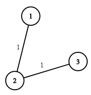

### [Optimize Water Distribution in a Village](https://leetcode.com/problems/optimize-water-distribution-in-a-village/) <br>

There are `n` houses in a village. We want to supply water for all the houses by building wells and laying pipes.

For each house `i`, we can either build a well inside it directly with cost `wells[i - 1]` (note the `-1` due to **0-indexing**), or pipe in water from another well to it. The costs to lay pipes between houses are given by the array `pipes`, where each  = [, , ] represents the cost to connect  and  together using a pipe. Connections are bidirectional.

Return the **minimum total cost to supply water to all houses**.


#### Example 1:


```
Input: n = 3, wells = [1,2,2], pipes = [[1,2,1],[2,3,1]]
Output: 3
Explanation: 
The image shows the costs of connecting houses using pipes.
The best strategy is to build a well in the first house with cost 1 and connect the other houses to it with cost 2 so the total cost is 3.

```

#### Example 2:

```
Input: n = 2, wells = [1,1], pipes = [[1,2,1]]
Output: 2

```

# Solutions

### Python
```
class Solution:
    def minCostToSupplyWater(self, n: int, wells: List[int], pipes: List[List[int]]) -> int:
        '''
        Prim's Algorithm with Heap
        
        Trick here is to add add a virtual vertex 0. And it will turn wells costs into pipes costs
        
        '''
        # bidirectional graph represented in adjacency list
        graph = defaultdict(list)

        # add a virtual vertex indexed with 0.
        #   then add an edge to each of the house weighted by the cost
        for index, cost in enumerate(wells):
            graph[0].append((cost, index + 1))

        # add the bidirectional edges to the graph
        for house_1, house_2, cost in pipes:
            graph[house_1].append((cost, house_2))
            graph[house_2].append((cost, house_1))

        # A set to maintain all the vertex that has been added to
        #   the final MST (Minimum Spanning Tree),
        #   starting from the vertex 0.
        mst_set = set([0])

        # heap to maitain the order of edges to be visited,
        #   starting from the edges originated from the vertex 0.
        # Note: we can start arbitrarily from any node.
        heapq.heapify(graph[0])
        edges_heap = graph[0]

        total_cost = 0
        while len(mst_set) < n + 1:
            cost, next_house = heapq.heappop(edges_heap)
            if next_house not in mst_set:
                # adding the new vertex into the set
                mst_set.add(next_house)
                total_cost += cost
                # expanding the candidates of edge to choose from
                #   in the next round
                for new_cost, neighbor_house in graph[next_house]:
                    if neighbor_house not in mst_set:
                        heapq.heappush(edges_heap, (new_cost, neighbor_house))

        return total_cost


#     def minCostToSupplyWater(self, n: int, wells: List[int], pipes: List[List[int]]) -> int:
#         '''
#         Kruskal’s Algorithm with 
#         Disjoint set (Union find)
#         Trick here is to add add a virtual vertex 0. And it will turn wells costs into pipes costs.
#         And just find Mininum Spanning Tree as usual.
#         '''
#         root=[i for i in range(n+1)]
#         rank=[1]*(n+1)
        
#         def find(x):
#             if root[x] == x:
#                 return x
#             root[x]=find(root[x])
#             return root[x]
        
#         # If there is a cycle funtion returns False
#         def union(x, y):
#             rootX=find(x)
#             rootY=find(y)
#             if rootY != rootX:
#                 root[rootY] = rootX
#                 return True
#             else:
#                 return False

#         # Turn wells into edges connected to 0
#         edges = []
#         for index, cost in enumerate(wells):
#             edges.append((cost, 0, index+1))
            
#         # Add pipes to edges
#         for h1, h2, cost in pipes:
#             edges.append((cost, h1, h2))
            
#         # sort edges by cost
#         edges.sort(key=lambda x: x[0])
        
#         res=0
        
#         for cost, h1, h2 in edges:
#             if union(h1, h2)==True:
#                 res += cost
                
#         return res

```
