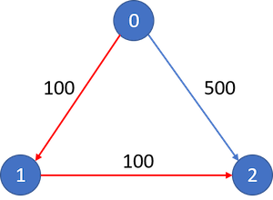

### [Cheapest Flights Within K Stops](https://leetcode.com/problems/cheapest-flights-within-k-stops/) <br>

There are n cities connected by some number of flights. You are given an array flights where  = [, , ] indicates that there is a flight from city  to city  with cost .

You are also given three integers `src`, `dst`, and `k`, return **the cheapest price** *from* `src` *to* `dst` *with at most* `k` *stops*. If there is no such route, return `-1`.


#### Example 1:


```
Input: n = 3, flights = [[0,1,100],[1,2,100],[0,2,500]], src = 0, dst = 2, k = 1
Output: 200
Explanation: The graph is shown.
The cheapest price from city 0 to city 2 with at most 1 stop costs 200, as marked red in the picture.

```

#### Example 2:


```
Input: n = 3, flights = [[0,1,100],[1,2,100],[0,2,500]], src = 0, dst = 2, k = 0
Output: 500
Explanation: The graph is shown.
The cheapest price from city 0 to city 2 with at most 0 stop costs 500, as marked blue in the picture.

```

# Solutions

### Python
```
class Solution:
    def findCheapestPrice(self, n: int, flights: List[List[int]], src: int, dst: int, k: int) -> int:
        '''
        Bellman Ford Algorithm
        
        The key here is to use copy tmp_prices array, it is like BFS layering, we limit our reach by step
        if we wouldn't use tmp_prices array, it would be something similar to Dijkstra.
        
                https://www.youtube.com/watch?v=5eIK3zUdYmE&ab_channel=NeetCode
                https://youtu.be/5eIK3zUdYmE

        '''
        prices = [float('inf')]*n
        prices[src] = 0  # cost for reaching source is zero
        
        # in original Bellmand Ford we usually run it n-1 times
        # here since problem has k condition we run it k+1 times
        for i in range(k+1):
            
            # we have to use temporary array here
            # because we have k limitation
            tmp_prices=prices.copy()
            
            for s, d, p in flights: # s=source d=destination p=price
                if tmp_prices[s]==float('inf'):
                    continue
                    
                # compare with original price is like we compare with previous step 
                if prices[s]+p < tmp_prices[d]:
                    tmp_prices[d]=prices[s]+p
                
            prices=tmp_prices
            
        
        if prices[dst]==float('inf'):
            return -1
        return prices[dst]

```
