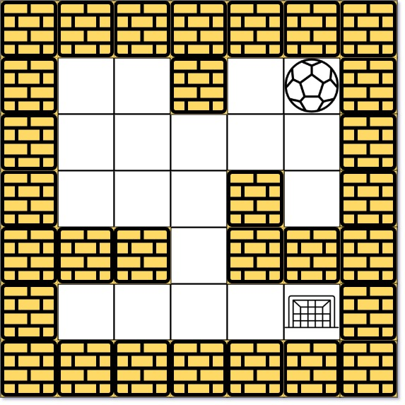

### [The Maze II](https://leetcode.com/problems/the-maze-ii/) <br>

There is a ball in a `maze` with empty spaces (represented as `0`) and walls (represented as `1`). The ball can go through the empty spaces by rolling **up, down, left or right,** but it won't stop rolling until hitting a wall. When the ball stops, it could choose the next direction.

Given the `m x n` `maze`, the ball's `start` position and the `destination`, where  = [, ] and  = [, ], return *the shortest **distance** for the ball to stop at the destination. If the ball cannot stop at `destination`, return `-1`*.

The **distance** is the number of **empty spaces** traveled by the ball from the start position (excluded) to the destination (included).

You may assume that **the borders of the maze are all walls** (see examples).


#### Example 1:


```
Input: maze = [[0,0,1,0,0],[0,0,0,0,0],[0,0,0,1,0],[1,1,0,1,1],[0,0,0,0,0]], start = [0,4], destination = [4,4]
Output: 12
Explanation: One possible way is : left -> down -> left -> down -> right -> down -> right.
The length of the path is 1 + 1 + 3 + 1 + 2 + 2 + 2 = 12.

```

#### Example 2:


```
Input: maze = [[0,0,1,0,0],[0,0,0,0,0],[0,0,0,1,0],[1,1,0,1,1],[0,0,0,0,0]], start = [0,4], destination = [3,2]
Output: -1
Explanation: There is no way for the ball to stop at the destination. Notice that you can pass through the destination but you cannot stop there.

```

#### Example 3:

```
Input: maze = [[0,0,0,0,0],[1,1,0,0,1],[0,0,0,0,0],[0,1,0,0,1],[0,1,0,0,0]], start = [4,3], destination = [0,1]
Output: -1

```


# Solutions


### CPP
```
class Solution {
public:
    int shortestDistance(vector<vector<int>>& maze, vector<int>& start, vector<int>& dest) {
        /*
            SPFA    (Optimized Bellman Ford)
            Shortest Path Faster Algorithm    
        */
        
        int h=maze.size(),w=maze[0].size();        
        vector<pair<int,int>>dirs={{1,0},{-1,0},{0,1},{0,-1}};
        
        deque<pair<int,int>>q; // row, col
        q.push_back({start[0],start[1]});
        
        vector<vector<int>>distances(h, vector<int>(w, -1)); // Distances,
        distances[start[0]][start[1]]=0; // initial
                
        while (not q.empty()) {
            int row=q.back().first, col=q.back().second;
            int prevDistance = distances[row][col];
            q.pop_back();
            
            for (auto &dir:dirs){
                int r=row, c=col;
                int rr = dir.first, cc = dir.second;
                int steps=0;
                while (r+rr>=0 and r+rr<h and c+cc>=0 and c+cc<w and maze[r+rr][c+cc]==0) {
                    r += rr;
                    c += cc;
                    steps++;
                }
                if ( distances[r][c]==-1  or  distances[r][c] > steps+prevDistance) { // If not visited OR prev distance is too big
                    distances[r][c]=steps+prevDistance;
                    q.push_front({r, c});
                } 
                
            }
        }
        
        return distances[dest[0]][dest[1]];
    }
};


class Solution {
public:
    int pack(int r, int c) {
        return (r<<16) + c;
    }
    pair<int,int> unpack(int val) {
        int r=(val>>16), c=val-(r<<16);
        return {r,c};
    }    
    int shortestDistance(vector<vector<int>>& maze, vector<int>& start, vector<int>& dest) {
        /*
            Dijkstra algorithm
        */
        
        int h=maze.size(),w=maze[0].size();
        //min heap
        priority_queue< pair<int,int>, vector<pair<int,int>>, greater<pair<int,int>>>pq; // path ,{row, col}
        
        vector<vector<int>>dirs={{1,0},{-1,0},{0,1},{0,-1}};
        pq.push({0, pack(start[0],start[1])});
        
        unordered_map<int,int>distances; // {row,col}, distance
        distances[pack(start[0],start[1])]=0;
        
        while (not pq.empty()) {
            auto unpacked=unpack(pq.top().second);
            int row=unpacked.first, col=unpacked.second, path=pq.top().first;
            pq.pop();
            
            if (row==dest[0] and col==dest[1]){
                return path;
            }
            
            for (auto &dir:dirs){
                int r=row, c=col;
                int add=0;
                while (r+dir[0]>=0 and r+dir[0]<h and c+dir[1]>=0 and c+dir[1]<w and maze[r+dir[0]][c+dir[1]]==0) {
                    r += dir[0];
                    c += dir[1];
                    add++;
                }
                int pa=pack(r,c);
                if (!distances.count(pa) or distances.count(pa) and distances[pa] > add+path) { // If not visited OR prev 
                    distances[pa]=add+path;
                    if (r==dest[0] and c==dest[1]) {
                        return add+path;
                    }
                    pq.push({add+path, pa});
                }

            }
        }
        return -1;
    }
};
```
