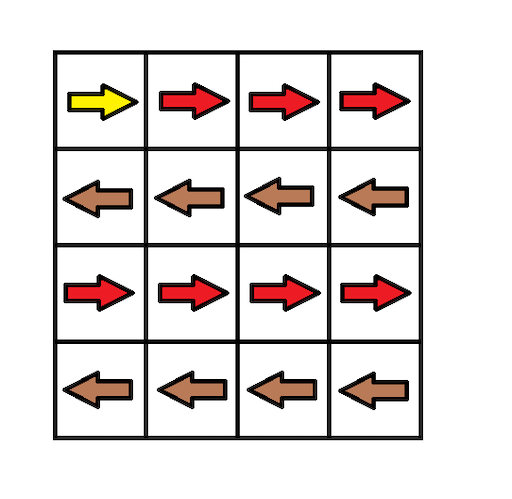

### [Minimum Cost to Make at Least One Valid Path in a Grid](https://leetcode.com/problems/minimum-cost-to-make-at-least-one-valid-path-in-a-grid/) <br>

Given a *m x n* `grid`. Each cell of the `grid` has a sign pointing to the next cell you should visit if you are currently in this cell. The sign of `grid[i][j]` can be:

 - **1** which means go to the cell to the right. (i.e go from `grid[i][j]` to `grid[i][j + 1]`)
 - **2** which means go to the cell to the left. (i.e go from `grid[i][j]` to `grid[i][j - 1]`)
 - **3** which means go to the lower cell. (i.e go from `grid[i][j]` to `grid[i + 1][j]`)
 - **4** which means go to the upper cell. (i.e go from `grid[i][j]` to `grid[i - 1][j]`)

Notice that there could be some **invalid signs** on the cells of the `grid` which points outside the `grid`.

You will initially start at the upper left cell `(0,0)`. A valid path in the grid is a path which starts from the upper left cell `(0,0)` and ends at the bottom-right cell `(m - 1, n - 1)` following the signs on the grid. The valid path **doesn't have to be the shortest**.

You can modify the sign on a cell with `cost = 1`. You can modify the sign on a cell **one time only**.

Return the *minimum cost* to make the grid have at least one valid path.


#### Example 1:


```
Input: grid = [[1,1,1,1],[2,2,2,2],[1,1,1,1],[2,2,2,2]]
Output: 3
Explanation: You will start at point (0, 0).
The path to (3, 3) is as follows. (0, 0) --> (0, 1) --> (0, 2) --> (0, 3) change the arrow to down with cost = 1 --> (1, 3) --> (1, 2) --> (1, 1) --> (1, 0) change the arrow to down with cost = 1 --> (2, 0) --> (2, 1) --> (2, 2) --> (2, 3) change the arrow to down with cost = 1 --> (3, 3)
The total cost = 3.

```

#### Example 2:


```
Input: grid = [[1,1,3],[3,2,2],[1,1,4]]
Output: 0
Explanation: You can follow the path from (0, 0) to (2, 2).

```


#### Example 3:


```
Input: grid = [[1,2],[4,3]]
Output: 1

```


#### Example 4:

```
Input: grid = [[2,2,2],[2,2,2]]
Output: 3

```

#### Example 5:

```
Input: grid = [[4]]
Output: 0

```


# Solutions

### Python
```
class Solution:
    def minCost(self, grid: List[List[int]]) -> int:
        '''        
        Dijkstra algorithm.
        
         Same as below, but shorter, withou buildng a graph
        '''
        dirs={1:(0,1), 2:(0,-1), 3: (1,0), 4:(-1,0)}
        h=len(grid)
        w=len(grid[0])
                                
        heap=[(0,0,0)] # path, row, col
        vis=set()
        while heap:
            path, row, col = heappop(heap)
            if (row, col) == (h-1, w-1):
                return path
            if (row, col) in vis:
                continue
            vis.add((row,col))            
            
            for dirKey, dirVal in dirs.items():
                x,y = dirVal
                new_r=row+x
                new_c=col+y
                if 0<=new_r<h and 0<=new_c<w and (new_r,new_c) not in vis:
                    if dirKey == grid[row][col]:
                        heappush(heap, (path, new_r, new_c))
                    else:
                        heappush(heap, (path+1, new_r, new_c))
                    
            
        return -1
    
    
#     def minCost(self, grid: List[List[int]]) -> int:
#         '''
#         Dijkstra algorithm.
        
#          - convert each [i, j] into node with four (or less) edges.
#          edges along direction cost=0
#          adjacent edges cost=1
#         '''
#         graph=collections.defaultdict(list)
#         dirs={1:(0,1), 2:(0,-1), 3: (1,0), 4:(-1,0)}
#         h=len(grid)
#         w=len(grid[0])
        
#         # building graph
#         for row in range(h):
#             for col in range(w):
#                 for key, val in dirs.items():
#                     x,y = val
#                     r=row+x
#                     c=col+y
#                     if 0<=r<h and 0<=c<w:
#                         source=(row,col)
#                         destination=(r,c)
#                         weight=1
#                         if key==grid[row][col]: # along direction
#                             weight=0
#                         graph[source].append((weight, destination))
                        
#         # print(graph)                        
#         heap=[(0,0,0)] # path, row, col
#         vis=set()
#         while heap:
#             path, row, col = heappop(heap)
#             if (row, col) == (h-1, w-1):
#                 return path
#             if (row, col) in vis:
#                 continue
#             vis.add((row,col))            
            
#             for weight, dest in graph[(row, col)]:
#                 if dest not in vis:
#                     heappush(heap, (path+weight, dest[0], dest[1]))
#         return -1    

```
