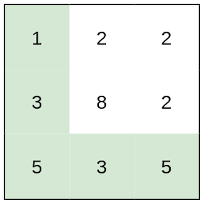
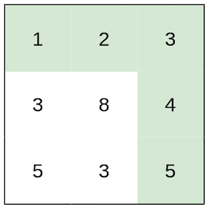
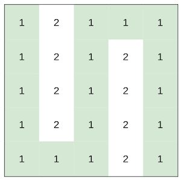

### [Path With Minimum Effort](https://leetcode.com/problems/path-with-minimum-effort/) <br>

You are a hiker preparing for an upcoming hike. You are given `heights`, a 2D array of size `rows x columns`, where `heights[row][col]` represents the height of cell `(row, col)`. You are situated in the top-left cell, `(0, 0)`, and you hope to travel to the bottom-right cell, `(rows-1, columns-1)` (i.e., **0-indexed**). You can move **up**, **down**, **left**, or **right**, and you wish to find a route that requires the minimum **effort**.

A route's **effort** is the **maximum absolute difference** in heights between two consecutive cells of the route.

Return the *minimum* **effort** *required to travel from the top-left cell to the bottom-right cell*.


#### Example 1:


```
Input: heights = [[1,2,2],[3,8,2],[5,3,5]]
Output: 2
Explanation: The route of [1,3,5,3,5] has a maximum absolute difference of 2 in consecutive cells.
This is better than the route of [1,2,2,2,5], where the maximum absolute difference is 3.

```

#### Example 2:


```
Input: heights = [[1,2,3],[3,8,4],[5,3,5]]
Output: 1
Explanation: The route of [1,2,3,4,5] has a maximum absolute difference of 1 in consecutive cells, which is better than route [1,3,5,3,5].

```

#### Example 3:


```
Input: heights = [[1,2,1,1,1],[1,2,1,2,1],[1,2,1,2,1],[1,2,1,2,1],[1,1,1,2,1]]
Output: 0
Explanation: This route does not require any effort.

```


# Solutions

### Python
```
class Solution:
    def minimumEffortPath(self, heights: List[List[int]]) -> int:
        '''
        Dijkstra algorithm
        
        BFS. but instead of queue we use heap.
        Heap always returns smallest effort at pop.
        '''
        if not heights: return 0
        
        h=len(heights)
        w=len(heights[0])
        res=-1
        vis=set()
        # vis.add((0, 0))
        
        heap=[(0, 0, 0)] # effort, row, col
        while heap:
            effort, r, c = heappop(heap)
            
            res=max(res, effort)
            if r==(h-1) and c==(w-1):
                return res
            
            # Add to vis after we fully processed the cell
            vis.add((r, c)) 
            
            for dr, dc in [(-1,0),(1,0),(0,-1),(0,1)]:
                new_r=r+dr
                new_c=c+dc
                
                if 0<=new_r<h and 0<=new_c<w and (new_r,new_c) not in vis:
                    new_effort = abs(heights[r][c]-heights[new_r][new_c])
                    heappush(heap, (new_effort, new_r, new_c))
                    
        return -1
    
    
#     def minimumEffortPath(self, heights: List[List[int]]) -> int:
#         '''
#         Explanation: https://www.youtube.com/watch?v=h11y_OJlgig&ab_channel=TimothyHChang
        
#         DFS with BinarySearch
#         '''
    
#         h=len(heights)
#         w=len(heights[0])
#         dirs=[(-1,0),(1,0),(0,1),(0,-1)]
        
#         # DFS
#         def dfs(k, r, c):
#             visited.add((r, c))
#             for dr, dc in dirs:
#                 new_r, new_c = r+dr, c+dc
#                 if 0<=new_r<h and 0<=new_c<w and (new_r, new_c) not in visited:
#                     new_k=abs(heights[r][c]-heights[new_r][new_c])
#                     if new_k <= k:
#                         dfs(k, new_r, new_c)
        
#         # Binary Search
#         lo, hi = 0, max([heights[r][c] for c in range(w) for r in range(h)]) # Lowest and Highest K
#         while lo<=hi:
#             mid=lo+(hi-lo)//2
#             visited=set()
#             dfs(mid, 0, 0)
#             if (h-1, w-1) in visited: # if we finished the path, that means k is too high
#                 hi=mid-1
#             else:
#                 lo=mid+1
#         return lo

```
