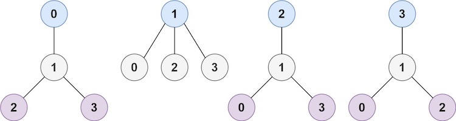
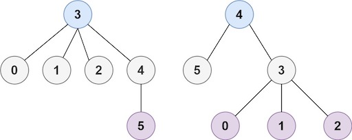

### [Minimum Height Trees](https://leetcode.com/problems/minimum-height-trees/) <br>

A tree is an undirected graph in which any two vertices are connected by exactly one path. In other words, any connected graph without simple cycles is a tree.

Given a tree of n nodes labelled from `0` to `n - 1`, and an array of `n - 1` edges where  = [, ] indicates that there is an undirected edge between the two nodes  and  in the tree, you can choose any node of the tree as the root. When you select a node `x` as the root, the result tree has height `h`. Among all possible rooted trees, those with minimum height (i.e. `min(h)`)  are called **minimum height trees** (MHTs).

Return a list of all **MHTs**' root labels. You can return the answer in **any order**.

The **height** of a rooted tree is the number of edges on the longest downward path between the root and a leaf.


#### Example 1:


```
Input: n = 4, edges = [[1,0],[1,2],[1,3]]
Output: [1]
Explanation: As shown, the height of the tree is 1 when the root is the node with label 1 which is the only MHT.

```

#### Example 2:


```
Input: n = 6, edges = [[3,0],[3,1],[3,2],[3,4],[5,4]]
Output: [3,4]

```


#### Example 3:

```
Input: n = 1, edges = []
Output: [0]

```


#### Example 4:

```
Input: n = 2, edges = [[0,1]]
Output: [0,1]

```

# Solutions

### Python
```
class Solution:
    
    def findMinHeightTrees(self, n: int, edges: List[List[int]]) -> List[int]:
        '''
        Topological Sort
        '''
        if n<=2:
            return [i for i in range(n)]
        
        graph=collections.defaultdict(set)
        in_degree={}
        for a, b in edges:
            graph[a].add(b)
            graph[b].add(a)
            in_degree[a]=1+in_degree.get(a, 0)
            in_degree[b]=1+in_degree.get(b, 0)
          
        # getting leaf nodes
        q=collections.deque([k for k,v in in_degree.items() if v==1])
        total_nodes=n
    
        while total_nodes>2:
            total_nodes -= len(q)
            q_next=collections.deque()
            
            while q:
                node = q.pop()
                neighbor = graph[node].pop() # remove neighbor from node's set
                graph[neighbor].remove(node) # remove node from neighbor's set
                
                if len(graph[neighbor])==1: 
                    q_next.appendleft(neighbor)
                    
            q=q_next
                        
        return q        

```
