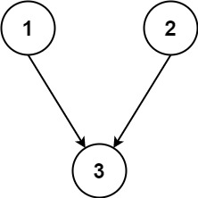
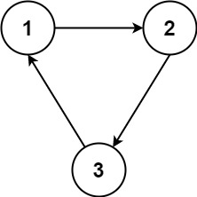

### [Parallel Courses](https://leetcode.com/problems/parallel-courses/) <br>

You are given an integer `n`, which indicates that there are `n` courses labeled from `1` to `n`. You are also given an array relations where  = [, ], representing a prerequisite relationship between course  and course : course  has to be taken before course .

In one semester, you can take **any number** of courses as long as you have taken all the prerequisites in the **previous** semester for the courses you are taking.

Return the **minimum** *number of semesters needed to take all courses*. If there is no way to take all the courses, return `-1`.


#### Example 1:


```
Input: n = 3, relations = [[1,3],[2,3]]
Output: 2
Explanation: The figure above represents the given graph.
In the first semester, you can take courses 1 and 2.
In the second semester, you can take course 3.

```

#### Example 2:


```
Input: n = 3, relations = [[1,2],[2,3],[3,1]]
Output: -1
Explanation: No course can be studied because they are prerequisites of each other.

```


# Solutions

### Python
```
class Solution:
    def minimumSemesters(self, n: int, relations: List[List[int]]) -> int:
        '''
        Topological Sort with Kahn's algorithm
        '''
        graph=collections.defaultdict(set)
        in_degree={}        
        for prv, nxt in relations:
            graph[prv].add(nxt)
            in_degree[nxt]=1+in_degree.get(nxt, 0)
            
        q=collections.deque([i for i in range(1, n+1) if i not in in_degree.keys()])
        
        res=0
        total_nodes=n
        
        while q:
            size=len(q)
            total_nodes -= size
            res += 1
            while size>0:
                node=q.pop()
                
                for next_node in graph[node]:
                    in_degree[next_node] -= 1
                    if in_degree[next_node] == 0:
                        q.appendleft(next_node)
                        
                size -= 1
        
        if total_nodes != 0:
            return -1
        return res
```
