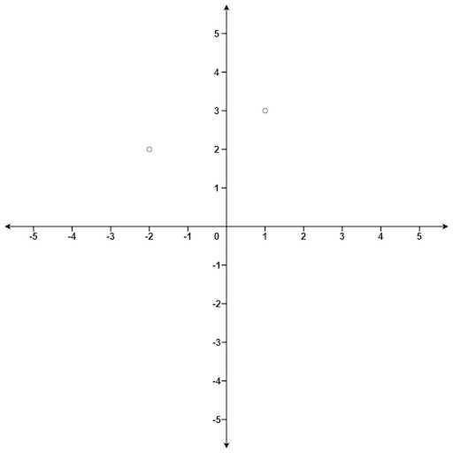

### [K Closest Points to Origin](https://leetcode.com/problems/k-closest-points-to-origin/) <br>

Given an array of `points` where  = [, ] represents a point on the **X-Y** plane and an integer `k`, return the `k` closest points to the origin `(0, 0)`.

The distance between two points on the **X-Y** plane is the Euclidean distance (i.e., √ + ).

You may return the answer in **any order**. The answer is **guaranteed** to be **unique** (except for the order that it is in).


#### Example 1:


```
Input: points = [[1,3],[-2,2]], k = 1
Output: [[-2,2]]
Explanation:
The distance between (1, 3) and the origin is sqrt(10).
The distance between (-2, 2) and the origin is sqrt(8).
Since sqrt(8) < sqrt(10), (-2, 2) is closer to the origin.
We only want the closest k = 1 points from the origin, so the answer is just [[-2,2]].

```

#### Example 2:

```
Input: points = [[3,3],[5,-1],[-2,4]], k = 2
Output: [[3,3],[-2,4]]
Explanation: The answer [[-2,4],[3,3]] would also be accepted.

```


# Solutions

### Python
```
class Solution:
    def kClosest(self, points: List[List[int]], k: int) -> List[List[int]]:
        pts=[]
        for p in points:
            d=p[0]**2 + p[1]**2
            pts.append((d, p))
        
        pts.sort(key=lambda tup: tup[0])
        
        return [pts[i][1]  for i in range(k)] # <--- list comprehension verion

```
