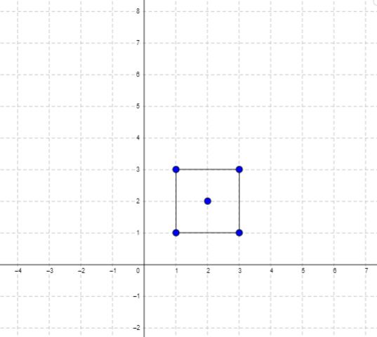

### [Minimum Area Rectangle](https://leetcode.com/problems/minimum-area-rectangle/) <br>

You are given an array of points in the **X-Y** plane `points` where  = [, ].

Return *the minimum area of a rectangle formed from these points, with sides parallel to the X and Y axes*. If there is not any such rectangle, return `0`.


#### Example 1:


```
Input: points = [[1,1],[1,3],[3,1],[3,3],[2,2]]
Output: 4

```

#### Example 2:


```
Input: points = [[1,1],[1,3],[3,1],[3,3],[4,1],[4,3]]
Output: 2

```


# Solutions

### Python
```
class Solution:
    def minAreaRect(self, points: List[List[int]]) -> int:
        '''
        A ------- B 
        |         | 
        |         |
        D ------- C        
        
        The ideas is to find diagonal points A and C   or  D anb B
        
        1. In map we store all `y` related to that `x`
        2. In double loop compare points: point1 and point2
        3. Check if two points have intersection by `y`
        
        '''        
        
        dic=collections.defaultdict(set)
        for x, y in points:
            dic[x].add(y)        
        
        res=sys.maxsize
        # print(dic)
        
        for x1,y1 in points:
            for x2,y2 in points:
                if  x1==x2 or y1==y2: # ignore not diagonal points
                    continue
                
                # find diagonal points A and C   or     D and B
                if y1 in dic[x2] and y2 in dic[x1]:
                    area=abs(x1-x2)*abs(y1-y2)
                    res=min(res, area)
        
        if res==sys.maxsize:
            return 0
        return res
```
