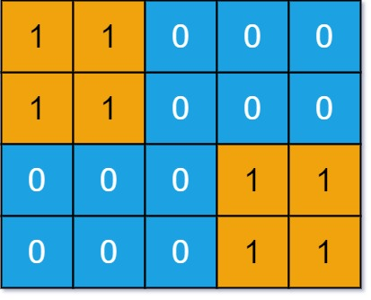

### [Number of Distinct Islands](https://leetcode.com/problems/number-of-distinct-islands/) <br>

You are given an `m x n` binary matrix `grid`. An island is a group of `1`'s (representing land) connected **4-directionally** (horizontal or vertical.) You may assume all four edges of the grid are surrounded by water.

An island is considered to be the same as another if and only if one island can be translated (and not rotated or reflected) to equal the other.

Return *the number of ***distinct*** islands*.


#### Example 1:


```
Input: grid = [[1,1,0,0,0],[1,1,0,0,0],[0,0,0,1,1],[0,0,0,1,1]]
Output: 1

```

#### Example 2:


```
Input: grid = [[1,1,0,1,1],[1,0,0,0,0],[0,0,0,0,1],[1,1,0,1,1]]
Output: 3

```


# Solutions

### Python
```
class Solution:
    def numDistinctIslands(self, grid: List[List[int]]) -> int:
        '''
        By hash of local coordinates.
        '''
        if not grid: return 0
        h=len(grid)
        w=len(grid[0])
        
        unique_islands=set()
        
        def dfs(r, c, origin_r, origin_c, current_island):
            if r<0 or r>=h or c<0 or c>=w or grid[r][c] != 1:
                return
            grid[r][c]=-1
            current_island.append((r - origin_r, c - origin_c)) # Adding coordinates extracting origin
            
            dfs(r+1, c, origin_r, origin_c, current_island)
            dfs(r-1, c, origin_r, origin_c, current_island)
            dfs(r, c+1, origin_r, origin_c, current_island)
            dfs(r, c-1, origin_r, origin_c, current_island)
        
        for row in range(len(grid)):
            for col in range(len(grid[row])):
                if grid[row][col]:
                    current_island=[]
                    dfs(row, col, row, col, current_island)
                    if len(current_island)>0:
                        unique_islands.add(frozenset(current_island)) # frozenset turn array of tuples into hashed value
                    
        
        return len(unique_islands)


    
#     def numDistinctIslands(self, grid: List[List[int]]) -> int:
#         '''
#         By hash of paths signatures.
#         '''
#         if not grid : return 0
        
#         h=len(grid)
#         w=len(grid[0])
            
#         def dfs(r,c, step, path):
#             if r<0 or r>=h or c<0 or c>=w or grid[r][c] != 1:
#                 return 
#             grid[r][c]=0
            
#             path += [step]
#             dfs(r+1, c, 'D', path)
#             dfs(r-1, c, 'U', path)
#             dfs(r, c+1, 'R', path)
#             dfs(r, c-1, 'L', path)
#             path += ["end"]
            
#         res=set()
#         for i in range(h):
#             for j in range(w):
#                 if grid[i][j]==1:
#                     path=[]
#                     dfs(i, j, 'start', path)
#                     # print("Path: "+str(tuple(path)))
#                     res.add(tuple(path))
#         return len(res)

```
