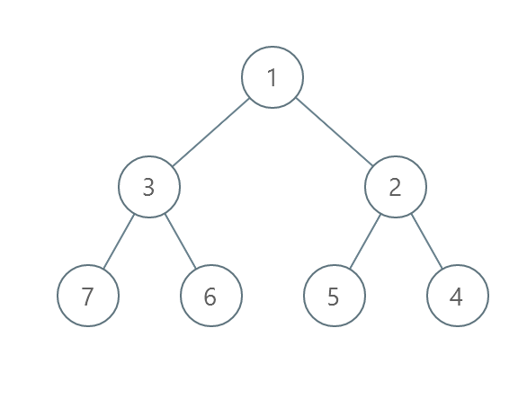
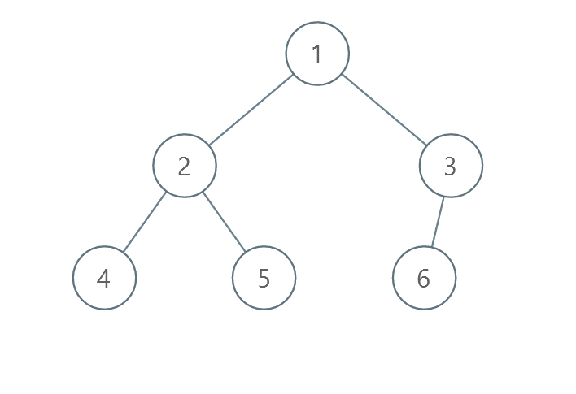

### [Minimum Number of Operations to Sort a Binary Tree by Level](https://leetcode.com/problems/minimum-number-of-operations-to-sort-a-binary-tree-by-level/) <br>

You are given the `root` of a binary tree with **unique values**.
In one operation, you can choose any two nodes **at the same level** and swap their values.
Return *the minimum number of operations needed to make the values at each level sorted in a* **strictly increasing order**.
The **level** of a node is the number of edges along the path between it and the root node.


#### Example 1:


```
Input: root = [1,4,3,7,6,8,5,null,null,null,null,9,null,10]
Output: 3
Explanation:
- Swap 4 and 3. The 2nd level becomes [3,4].
- Swap 7 and 5. The 3rd level becomes [5,6,8,7].
- Swap 8 and 7. The 3rd level becomes [5,6,7,8].
We used 3 operations so return 3.
It can be proven that 3 is the minimum number of operations needed.

```

#### Example 2:


```
Input: root = [1,3,2,7,6,5,4]
Output: 3
Explanation:
- Swap 3 and 2. The 2nd level becomes [2,3].
- Swap 7 and 4. The 3rd level becomes [4,6,5,7].
- Swap 6 and 5. The 3rd level becomes [4,5,6,7].
We used 3 operations so return 3.
It can be proven that 3 is the minimum number of operations needed.

```

#### Example 3:


```
Input: root = [1,2,3,4,5,6]
Output: 0
Explanation: Each level is already sorted in increasing order so return 0.

```


# Solutions

### Python
```
# Definition for a binary tree node.
# class TreeNode:
#     def __init__(self, val=0, left=None, right=None):
#         self.val = val
#         self.left = left
#         self.right = right
class Solution:
    def minimumOperations(self, root: Optional[TreeNode]) -> int:
        def countPermutations(arr): 
            sortedArr = sorted(arr)
            pos = {m:j for j,m in enumerate(sortedArr)}
            vis=[0]*len(arr)
            res=0
            for i in range(len(arr)):
                cnt = 0
                while not vis[i] and i != pos[arr[i]]:
                    vis[i] = 1
                    i = pos[arr[i]]
                    cnt += 1                          
                res += max(0, cnt-1)
            return res
        
        res=0
        d = collections.deque([root])
        while d:
            size = len(d)
            level = []
            while size>0:
                node = d.pop()
                level.append(node.val)
                if node.left: d.appendleft(node.left)
                if node.right: d.appendleft(node.right)
                size -= 1
            c = countPermutations(level)
            res += c
        return res
```

### CPP
```
/**
 * Definition for a binary tree node.
 * struct TreeNode {
 *     int val;
 *     TreeNode *left;
 *     TreeNode *right;
 *     TreeNode() : val(0), left(nullptr), right(nullptr) {}
 *     TreeNode(int x) : val(x), left(nullptr), right(nullptr) {}
 *     TreeNode(int x, TreeNode *left, TreeNode *right) : val(x), left(left), right(right) {}
 * };
 */
class Solution {
public:
    int countPerm(vector<int>& arr) {
        vector<int>sortedArr;
        for (auto el:arr)
            sortedArr.push_back(el);
        sort(sortedArr.begin(), sortedArr.end());
        unordered_map<int,int>mp;
        vector<int>vis(arr.size(), 0);
        for (int i=0;i<arr.size();i++)
            mp[sortedArr[i]]=i;
        
        int res = 0;
        for (int i=0;i<arr.size();i++) {
            int count = 0;
            int j = i;
            while (!vis[j] and j != mp[arr[j]]) {
                vis[j]=1;
                j = mp[arr[j]];
                count += 1;
            }
            res += max(0, count-1);
        }
        return res;
    }    
    
    int minimumOperations(TreeNode* root) {
        int res=0;
        queue <TreeNode*> q; q.push(root);
        while (!q.empty()) {
            int size = q.size();
            vector<int> level;
            while (size>0) {
                auto node = q.front();
                level.push_back(node->val);
                q.pop();
                if (node->left != nullptr)
                    q.push(node->left);
                if (node->right != nullptr)
                    q.push(node->right);
                size--;
            }
            res += countPerm(level);
        }
        return res;
    }
};
```
