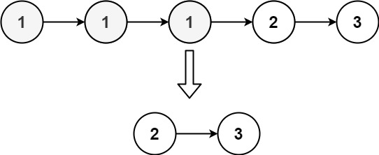

### [Remove Duplicates from Sorted List II](https://leetcode.com/problems/remove-duplicates-from-sorted-list-ii/) <br>

Given the `head` of a sorted linked list, *delete all nodes that have duplicate numbers, leaving only distinct numbers from the original list. Return the linked list ***sorted*** as well*.

 


#### Example 1:


```
Input: head = [1,2,3,3,4,4,5]
Output: [1,2,5]

```

#### Example 2:


```
Input: head = [1,1,1,2,3]
Output: [2,3]

```


# Solutions

### Python
```
# Definition for singly-linked list.
# class ListNode:
#     def __init__(self, val=0, next=None):
#         self.val = val
#         self.next = next
class Solution:
    def deleteDuplicates(self, head: Optional[ListNode]) -> Optional[ListNode]:
        dummy=ListNode()
        tail=dummy
        cur=head
        
        while cur:
            if cur and cur.next and cur.val == cur.next.val:
                duplic_val=cur.val
                while cur and cur.val == duplic_val:
                    cur=cur.next
            else:
                tail.next=cur
                tail=tail.next
                cur=cur.next
        tail.next=None
        return dummy.next

```
