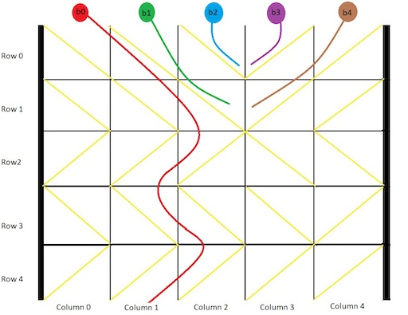

### [problem_title](https_problem_link) <br>

Problem_description


#### Example 1:


```
Example_one
```

#### Example 2:


```
Example_two
```

#### Example 3:


```
Example_one
```

#### Example 4:


```
Example_two
```

#### Example 5:


```
Example_one
```

#### Example 6:


```
Example_two
```


# Solutions

### Python
```
Python_code
```
