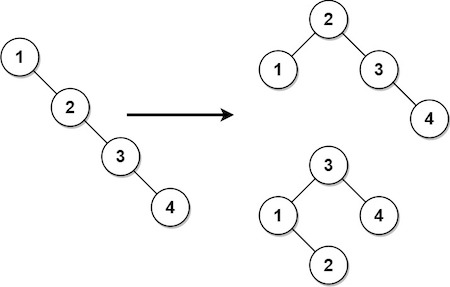
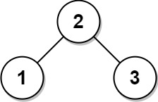

### [Balance a Binary Search Tree](https://leetcode.com/problems/balance-a-binary-search-tree/) <br>

Given the `root` of a binary search tree, return *a ***balanced*** binary search tree with the same node values*. If there is more than one answer, return **any of them**.

A binary search tree is **balanced** if the depth of the two subtrees of every node never differs by more than `1`.


#### Example 1:


```
Input: root = [1,null,2,null,3,null,4,null,null]
Output: [2,1,3,null,null,null,4]
Explanation: This is not the only correct answer, [3,1,4,null,2] is also correct.

```

#### Example 2:


```
Input: root = [2,1,3]
Output: [2,1,3]

```

# Solutions

### Python
```
# Definition for a binary tree node.
# class TreeNode:
#     def __init__(self, val=0, left=None, right=None):
#         self.val = val
#         self.left = left
#         self.right = right
class Solution:
    def balanceBST(self, root: TreeNode) -> TreeNode:
        '''
        1.-Save nodes in array of nodes first
        2.-Build ballanced tree recursevely: root-middle node in array, left-left array part, right-right part
        '''
        arr=[]
        
        def dfs(node):
            if node:
                dfs(node.left)                
                arr.append(node.val)                
                dfs(node.right)
                
        dfs(root)
        
        def build(nodes_arr):
            if not nodes_arr:
                return
            mid=len(nodes_arr)//2
            root=TreeNode(nodes_arr[mid])
            root.left=build(nodes_arr[:mid])
            root.right=build(nodes_arr[mid+1:])
            return root
        
        return build(arr)

```
