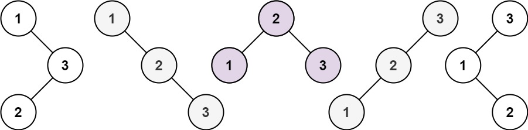

### [Unique Binary Search Trees II](https://leetcode.com/problems/unique-binary-search-trees-ii/) <br>

Given an integer `n`, *return all the structurally unique ***BST***'s (binary search trees), which has exactly `n` nodes of unique values from `1` to `n`*. Return the answer in **any order**.


#### Example 1:


```
Input: n = 3
Output: [[1,null,2,null,3],[1,null,3,2],[2,1,3],[3,1,null,null,2],[3,2,null,1]]

```

#### Example 2:

```
Input: n = 1
Output: [[1]]

```

# Solutions

### Python
```
# Definition for a binary tree node.
# class TreeNode:
#     def __init__(self, val=0, left=None, right=None):
#         self.val = val
#         self.left = left
#         self.right = right
class Solution:
    def generateTrees(self, n: int) -> List[TreeNode]:
        res=[]
        
        def dfs(start, end):
            if start>end:
                return [None,]
            
            all_trees=[]
            for i in range(start, end+1):
                
                right_trees=dfs(i+1, end)
                left_trees=dfs(start, i-1)
                
                for r in right_trees:
                    for l in left_trees:
                        root=TreeNode(i)
                        root.right=r
                        root.left=l
                        all_trees.append(root)
                
            return all_trees
            
            
        res = dfs(1, n)
        return res
```
