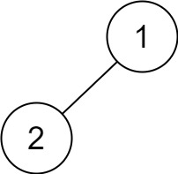

### [Binary Tree Postorder Traversal](https://leetcode.com/problems/binary-tree-postorder-traversal/) <br>

Given the `root` of a binary tree, return *the postorder traversal of its nodes' values*.


#### Example 1:


```
Input: root = [1,null,2,3]
Output: [3,2,1]

```

#### Example 2:

```
Input: root = []
Output: []

```


#### Example 3:

```
Input: root = [1]
Output: [1]

```

#### Example 4:


```
Input: root = [1,2]
Output: [2,1]

```


#### Example 5:


```
Input: root = [1,null,2]
Output: [2,1]

```


# Solutions

### Python
```
# Definition for a binary tree node.
# class TreeNode:
#     def __init__(self, val=0, left=None, right=None):
#         self.val = val
#         self.left = left
#         self.right = right
class Solution:
    def postorderTraversal(self, root: TreeNode) -> List[int]:
        res=[]
        stack=[root]
        cur=root

        while stack:
            last=stack.pop()
            if last:
                res.insert(0, last.val) # Insert to bottom
                stack.append(last.left)
                stack.append(last.right)
                
        
        return res
    
'''
    def preorderTraversal(self, root: TreeNode) -> List[int]:
        res=[]
        stack=[root]
        cur=root

        while stack:
            last=stack.pop()
            if last:
                res.append(last.val)
                stack.append(last.right)
                stack.append(last.left)
        
        return res
'''    

```
