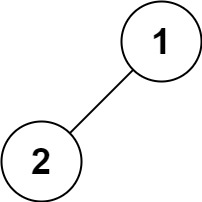

### [Binary Tree Preorder Traversal](https://leetcode.com/problems/binary-tree-preorder-traversal/) <br>

Given the `root` of a binary tree, return *the preorder traversal of its nodes' values*.


#### Example 1:


```
Input: root = [1,null,2,3]
Output: [1,2,3]

```

#### Example 2:

```
Input: root = []
Output: []

```


#### Example 3:

```
Input: root = [1]
Output: [1]

```


#### Example 4:


```
Input: root = [1,2]
Output: [1,2]

```


#### Example 5:


```
Input: root = [1,null,2]
Output: [1,2]

```


# Solutions

### Python
```
# Definition for a binary tree node.
# class TreeNode:
#     def __init__(self, val=0, left=None, right=None):
#         self.val = val
#         self.left = left
#         self.right = right
class Solution:    
    
    
#     def preorderTraversal(self, root: TreeNode) -> List[int]:
#         res=[]
#         stack=[root]
#         cur=root

#         while stack:
#             last=stack.pop()
#             if last:
#                 res.append(last.val)
#                 stack.append(last.right)
#                 stack.append(last.left)
        
#         return res
    
    def preorderTraversal(self, root: TreeNode) -> List[int]:
        res=[]        
        def preorder(node):
            if not node:
                return
            res.append(node.val)
            preorder(node.left)
            preorder(node.right)
        
        preorder(root)
        
        return res

```
