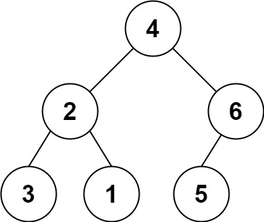

### [Construct Binary Tree from String](https://leetcode.com/problems/construct-binary-tree-from-string/) <br>

You need to construct a binary tree from a string consisting of parenthesis and integers.

The whole input represents a binary tree. It contains an integer followed by zero, one or two pairs of parenthesis. The integer represents the root's value and a pair of parenthesis contains a child binary tree with the same structure.

You always start to construct the **left** child node of the parent first if it exists.


#### Example 1:


```
Input: s = "4(2(3)(1))(6(5))"
Output: [4,2,6,3,1,5]

```

#### Example 2:

```
Input: s = "4(2(3)(1))(6(5)(7))"
Output: [4,2,6,3,1,5,7]

```

#### Example 3:

```
Input: s = "-4(2(3)(1))(6(5)(7))"
Output: [-4,2,6,3,1,5,7]

```


# Solutions

### Python
```
# Definition for a binary tree node.
# class TreeNode:
#     def __init__(self, val=0, left=None, right=None):
#         self.val = val
#         self.left = left
#         self.right = right
class Solution:
    def str2tree(self, s: str) -> TreeNode:
        n=len(s)
        i=0
        
        def dfs():
            nonlocal i
            nonlocal s
            
            if i >= n:
                return None
            
            # Node Creation
            neg=False
            if i<n and s[i]=='-':
                i += 1
                neg=True
            
            num=0
            while i<n and s[i].isdigit():
                num=num*10 + int(s[i])
                i += 1
            
            if neg==True:
                num = -num
            root=TreeNode(num)
            if i >= n:
                return root
        
        
            # Left
            if i<n and s[i]=='(':
                i += 1
                root.left = dfs()
                
            if i<n and s[i]==')':
                i += 1
                return root
            
            # Right
            if i<n and s[i]=='(':
                i += 1
                root.right=dfs()
                
            if i<n and s[i]==')':
                i += 1
                return root
            
            return root
            
        root = dfs()
        
        return root
```
