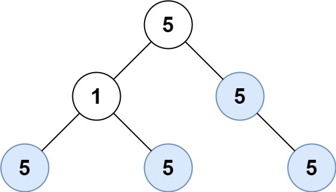

### [Count Univalue Subtrees](https://leetcode.com/problems/count-univalue-subtrees/) <br>

Given the `root` of a binary tree, return the number of **uni-value** subtrees.

A **uni-value subtree** means all nodes of the subtree have the same value.

 
#### Example 1:


```
Input: root = [5,1,5,5,5,null,5]
Output: 4

```

#### Example 2:

```
Input: root = []
Output: 0

```


#### Example 3:

```
Input: root = [5,5,5,5,5,null,5]
Output: 6

```


# Solutions

### Python
```
# Definition for a binary tree node.
# class TreeNode:
#     def __init__(self, val=0, left=None, right=None):
#         self.val = val
#         self.left = left
#         self.right = right
class Solution:
    def countUnivalSubtrees(self, root: TreeNode) -> int:
        res=0
        
        def dfs(node):
            nonlocal res
            
            if not node:
                return True
            
            left=dfs(node.left)
            right=dfs(node.right)
            
            if left and right:
                # if no children
                if not node.left and not node.right: 
                    res += 1
                    return True
                # if only left child and it's same as current
                if node.left and not node.right and node.val==node.left.val: 
                    res += 1
                    return True
                
                # if only right child and it's same as current
                if node.right and not node.left and node.val==node.right.val: 
                    res += 1
                    return True
                
                # if both children are same as current                
                if node.right and node.left and node.right.val==node.left.val==node.val: 
                    res += 1
                    return True
                
            return False
            
             
        dfs(root)    
        return res

```
