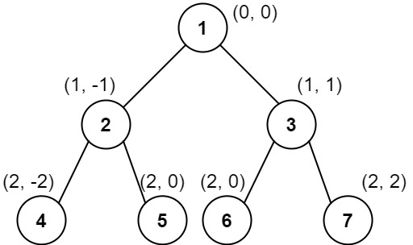

### [Vertical Order Traversal of a Binary Tree](https://leetcode.com/problems/vertical-order-traversal-of-a-binary-tree/) <br>

Given the `root` of a binary tree, calculate the **vertical order traversal** of the binary tree.

For each node at position `(row, col)`, its left and right children will be at positions `(row + 1, col - 1)` and `(row + 1, col + 1)` respectively. The root of the tree is at `(0, 0)`.

The **vertical order traversal** of a binary tree is a list of top-to-bottom orderings for each column index starting from the leftmost column and ending on the rightmost column. There may be multiple nodes in the same row and same column. In such a case, sort these nodes by their values.

Return *the ***vertical order traversal*** of the binary tree*.


#### Example 1:


```
Input: root = [3,9,20,null,null,15,7]
Output: [[9],[3,15],[20],[7]]
Explanation:
Column -1: Only node 9 is in this column.
Column 0: Nodes 3 and 15 are in this column in that order from top to bottom.
Column 1: Only node 20 is in this column.
Column 2: Only node 7 is in this column.

```

#### Example 2:


```
Input: root = [1,2,3,4,5,6,7]
Output: [[4],[2],[1,5,6],[3],[7]]
Explanation:
Column -2: Only node 4 is in this column.
Column -1: Only node 2 is in this column.
Column 0: Nodes 1, 5, and 6 are in this column.
          1 is at the top, so it comes first.
          5 and 6 are at the same position (2, 0), so we order them by their value, 5 before 6.
Column 1: Only node 3 is in this column.
Column 2: Only node 7 is in this column.

```


#### Example 3:


```
Input: root = [1,2,3,4,6,5,7]
Output: [[4],[2],[1,5,6],[3],[7]]
Explanation:
This case is the exact same as example 2, but with nodes 5 and 6 swapped.
Note that the solution remains the same since 5 and 6 are in the same location and should be ordered by their values.

```


# Solutions

### Python
```
# Definition for a binary tree node.
# class TreeNode:
#     def __init__(self, val=0, left=None, right=None):
#         self.val = val
#         self.left = left
#         self.right = right
class Solution:
#     def verticalTraversal(self, root: TreeNode) -> List[List[int]]:
#         stack=[root]
#         root.loc=(0, 0)
#         columns=collections.defaultdict(list)
#         columns[0].append(root)
        
#         # Preorder traverse and asign location and
#         # Group by columns
#         while stack:
#             nod=stack.pop()
#             row=nod.loc[0]
#             col=nod.loc[1]
            
#             if nod.left:
#                 nod.left.loc=(row+1, col-1)
#                 columns[col-1].append(nod.left)
#                 stack.append(nod.left)
#             if nod.right:
#                 nod.right.loc=(row+1, col+1)
#                 columns[col+1].append(nod.right)                
#                 stack.append(nod.right)
                
#         # Loop columns, and sort by 1.Rows, 2.Value
#         res=[]
#         cols=list(columns.keys())
#         cols.sort()
#         for col in cols:
#             rows=columns[col]
#             rows.sort(key=lambda tup:(tup.loc[0], tup.val)) # Sort by 1.Rows, 2.Value
#             res.append([no.val for no in rows])
        
        
#         return res
    
    
    def verticalTraversal(self, root: TreeNode) -> List[List[int]]:
        stack=[root]
        root.loc=(0, 0)
        columns=collections.defaultdict(list)
        
        # Preorder traverse and asign location and
        # Group by columns
        while stack:
            nod=stack.pop()
            row=nod.loc[0]
            col=nod.loc[1]
            columns[col].append(nod)    
            
            if nod.left:
                nod.left.loc=(row+1, col-1)
                stack.append(nod.left)
            if nod.right:
                nod.right.loc=(row+1, col+1)
                stack.append(nod.right)
                
        # Loop columns, and sort by 1.Rows, 2.Value
        res=[]
        cols=list(columns.keys())
        cols.sort()
        for col in cols:
            rows=columns[col]
            rows.sort(key=lambda tup:(tup.loc[0], tup.val)) # Sort by 1.Rows, 2.Value
            res.append([no.val for no in rows])
        
        
        return res        

```
