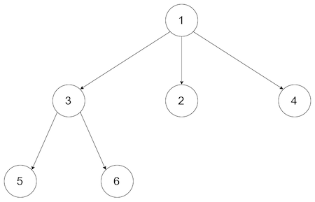
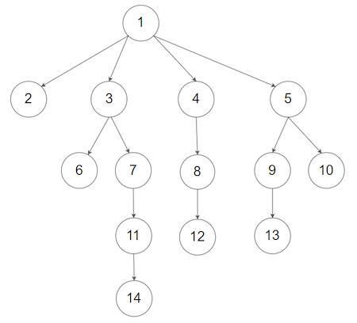

### [Serialize and Deserialize N-ary Tree](https://leetcode.com/problems/serialize-and-deserialize-n-ary-tree/) <br>

Serialization is the process of converting a data structure or object into a sequence of bits so that it can be stored in a file or memory buffer, or transmitted across a network connection link to be reconstructed later in the same or another computer environment.

Design an algorithm to serialize and deserialize an N-ary tree. An N-ary tree is a rooted tree in which each node has no more than N children. There is no restriction on how your serialization/deserialization algorithm should work. You just need to ensure that an N-ary tree can be serialized to a string and this string can be deserialized to the original tree structure.

For example, you may serialize the following `3-ary` tree


as `[1 [3[5 6] 2 4]]`. Note that this is just an example, you do not necessarily need to follow this format.

Or you can follow LeetCode's level order traversal serialization format, where each group of children is separated by the null value.



For example, the above tree may be serialized as `[1,null,2,3,4,5,null,null,6,7,null,8,null,9,10,null,null,11,null,12,null,13,null,null,14]`.

You do not necessarily need to follow the above-suggested formats, there are many more different formats that work so please be creative and come up with different approaches yourself.


#### Example 1:

```
Input: root = [1,null,2,3,4,5,null,null,6,7,null,8,null,9,10,null,null,11,null,12,null,13,null,null,14]
Output: [1,null,2,3,4,5,null,null,6,7,null,8,null,9,10,null,null,11,null,12,null,13,null,null,14]

```

#### Example 2:

```
Input: root = [1,null,3,2,4,null,5,6]
Output: [1,null,3,2,4,null,5,6]

```

#### Example 3:

```
Input: root = []
Output: []

```

# Solutions

### Python
```
"""
# Definition for a Node.
class Node(object):
    def __init__(self, val=None, children=None):
        self.val = val
        self.children = children
"""

class Codec:
#     def serialize(self, root: 'Node') -> str:
#         """Encodes a tree to a single string.
        
#         :type root: Node
#         :rtype: str
#         """
#         ans=""
#         id=1
#         queue=[(root,id)]
        
        
#         while queue:
#             size=len(queue)
#             while size>0:
#                 last, lid = queue.pop()
#                 if last:
#                     if last.children:
#                         for child in last.children:
#                             id += 1                                
#                             ans+=","+str(child.val)+"="+str(id)
#                             queue.insert(0, (child, id))
#                             start=True
#                     ans+="par"+str(last.val)+"="+str(lid)+"|"
#                     start=False
#                 size -= 1
#             if len(queue)>0:
#                 ans=ans[:-1]
#                 ans+="-lev-"
#         # print("serialize out: "+str(ans))
#         return ans
	
#     def deserialize(self, data: str) -> 'Node':
#         """Decodes your encoded data to tree.
        
#         :type data: str
#         :rtype: Node
#         """
#         root=None
#         levels=data.split("-lev-")
#         print(levels)
        
#         h={}
#         for i in range(len(levels)):
#             if levels[i] != "":
#                 par_split=levels[i].split("|")
                
#                 for par in par_split:
#                     if par=="":
#                         continue
#                     par_split_1=par.split("par")
                    
#                     if len(par_split_1)==0:
#                         continue
                    
#                     parent_raw=par_split_1.pop()
#                     parr=parent_raw.split("=")
#                     parent_val=parr[0]
#                     parent_id=parr[1]
#                     parent_key=parent_val+parent_id
                    
#                     # print("\nparen:"+str(parent))
                    
#                     if parent_key not in h.keys():
#                         pint=int(float(parent_val))
#                         pp=Node(pint, [])
#                         h[parent_key]=pp
#                     else:
#                         pp=h[parent_key]
                        
#                     if not root:
#                         root=pp       

                        
#                     children=par_split_1[0].split(",")
#                     chn=[]
#                     for child in children:
#                         if child=="":
#                             continue
#                         carr=child.split("=")
#                         child_val=carr[0]
#                         child_id=carr[1]
#                         child_key=child_val+child_id
                        
#                         cc=Node(int(child_val), [])
#                         chn.append(cc)
#                         # print("child:"+str(child))
#                         h[child_key]=cc
#                     pp.children=chn
                            
                
#         return root
    
    
    def serialize(self, root: 'Node') -> str:
        serial = []

        def preorder(node):
            if not node:
                return
            serial.append(str(node.val))
            for child in node.children:
                preorder(child)
            serial.append("#")      # indicates no more children, continue serialization from parent

        preorder(root)
        print("serialize out arr: "+str(serial))
        return " ".join(serial)

    def deserialize(self, data: str) -> 'Node':
        if not data:
            return None

        tokens = deque(data.split())
        root = Node(int(tokens.popleft()), [])

        def helper(node):

            if not tokens:
                return

            while tokens[0] != "#": # add child nodes with subtrees
                value = tokens.popleft()
                child = Node(int(value), [])
                node.children.append(child)
                helper(child)

            tokens.popleft()        # discard the "#"

        helper(root)
        return root

```
