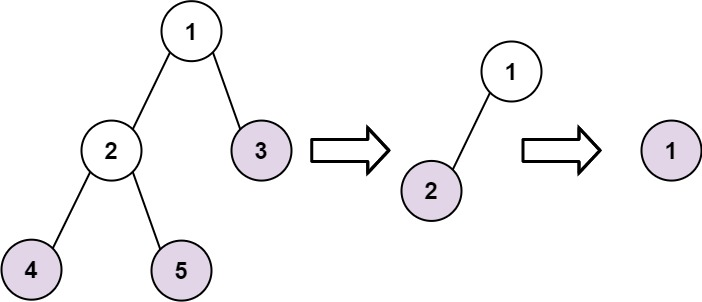

### [Find Leaves of Binary Tree](https://leetcode.com/problems/find-leaves-of-binary-tree/) <br>

Given the root of a binary tree, collect a tree's nodes as if you were doing this:

 - Collect all the leaf nodes.
 - Remove all the leaf nodes.
 - Repeat until the tree is empty.


#### Example 1:


```
Input: root = [1,2,3,4,5]
Output: [[4,5,3],[2],[1]]
Explanation:
[[3,5,4],[2],[1]] and [[3,4,5],[2],[1]] are also considered correct answers since per each level it does not matter the order on which elements are returned.

```

#### Example 2:

```
Input: root = [1]
Output: [[1]]

```

# Solutions

### Python
```
# Definition for a binary tree node.
# class TreeNode:
#     def __init__(self, val=0, left=None, right=None):
#         self.val = val
#         self.left = left
#         self.right = right
class Solution:
    def findLeaves(self, root: Optional[TreeNode]) -> List[List[int]]:
        res = collections.defaultdict(list)

        def dfs(node, layer):
            if not node: 
                return layer 
            left = dfs(node.left, layer)
            right = dfs(node.right, layer)
            layer = max(left, right)
            res[layer].append(node.val)
            return layer + 1

        dfs(root, 0)
        return res.values() 
    
    
#     def findLeaves(self, root: Optional[TreeNode]) -> List[List[int]]:
#         '''
#         Topological Sort with Kahn's algorithm (in_degree dictionary)
#         '''
#         in_degree={}
#         parent={}
#         def dfs(node):
#             if not node: return
#             in_degree[node]=0
#             if node.left:
#                 parent[node.left]=node                
#                 in_degree[node] += 1
#                 dfs(node.left)                
#             if node.right:
#                 parent[node.right]=node                
#                 in_degree[node] += 1
#                 dfs(node.right)
#         dfs(root)
        
#         leaves=[node for node,count in in_degree.items() if count==0]
#         q=collections.deque(leaves)
#         res=[]
#         while q:
#             size=len(q)
#             layer=[]
#             while size > 0:
#                 node=q.pop()
#                 layer.append(node.val)
                
#                 if node in parent:
#                     parent_node = parent[node]
#                     in_degree[parent_node] -= 1
                    
#                     if in_degree[parent_node] == 0:
#                         q.appendleft(parent_node)
                
#                 size -= 1
#             res.append(layer)
#         return res

```
